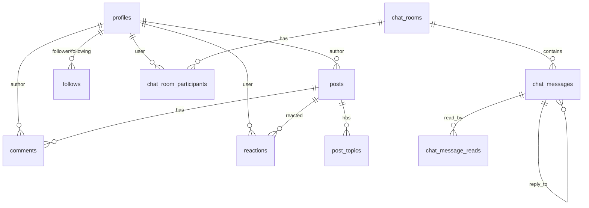

# AI 지식 교류 허브 - 통합 프로젝트 문서 (CLAUDE.md)

**문서 최종 업데이트**: 2025-10-01
**프로젝트 버전**: v0.3 (채팅 시스템 구현 완료)
**기술 스택**: Next.js 15.4.6, React 19.1.0, TypeScript 5, Supabase, shadcn/ui, Zustand 5.0.7, TailwindCSS 4
**Context7 MCP 호환**: ✅ 호환성 고려하여 작성됨

---

## 📋 목차

- [1. 프로젝트 개요](#1-프로젝트-개요)
- [2. 기술 스택 및 아키텍처](#2-기술-스택-및-아키텍처)
- [3. 프로젝트 구조](#3-프로젝트-구조)
- [4. 구현 현황](#4-구현-현황)
- [5. 채팅 시스템 상세](#5-채팅-시스템-상세)
- [6. 데이터베이스 설계](#6-데이터베이스-설계)
- [7. 알려진 문제점 및 개선사항](#7-알려진-문제점-및-개선사항)
- [8. 개발 가이드라인](#8-개발-가이드라인)
- [9. 성능 최적화](#9-성능-최적화)
- [10. 배포 및 운영](#10-배포-및-운영)
- [11. 향후 로드맵](#11-향후-로드맵)

---

## 1. 프로젝트 개요

### 🎯 제품 정의
- **프로젝트명**: AI 지식 교류 허브 (Team Hub)
- **목적**: AI 관련 정보의 신뢰도 높은 공유·탐색·토론을 위한 웹 플랫폼
- **핵심 가치**: 신뢰성, 속도, 참여, 재사용성
- **대상 사용자**: Creator, Learner, Curator, Organizer, Moderator, Admin

### 📊 프로젝트 상태
- **총 파일 수**: 150+ TypeScript/React 파일
- **컴포넌트 수**: 90+ 재사용 가능 컴포넌트
- **커스텀 훅**: 13개 전문화된 훅
- **API Routes**: 25+ RESTful 엔드포인트
- **테스트 파일**: 성능 테스트 및 단위 테스트 포함

---

## 2. 기술 스택 및 아키텍처

### 🔧 기술 스택 상세

```json
{
  "frontend": {
    "framework": "Next.js 15.4.6 (App Router, Turbopack)",
    "runtime": "React 19.1.0 (with React Compiler)",
    "language": "TypeScript 5 (strict mode)",
    "styling": "TailwindCSS 4",
    "ui": "shadcn/ui + Radix UI",
    "icons": "Lucide React",
    "state": "Zustand 5.0.7",
    "query": "TanStack Query (React Query)",
    "virtualization": "@tanstack/react-virtual"
  },
  "backend": {
    "database": "Supabase (PostgreSQL 15)",
    "auth": "Supabase Auth",
    "storage": "Supabase Storage",
    "realtime": "Supabase Realtime (WebSocket)"
  },
  "tooling": {
    "bundler": "Turbopack (Next.js 15)",
    "linter": "ESLint 9",
    "formatter": "Prettier 3.6",
    "types": "Supabase Generated Types + Custom Types"
  },
  "testing": {
    "unit": "Vitest 3.2.4",
    "e2e": "Playwright 1.55",
    "performance": "Vitest + Custom Performance Utils"
  }
}
```

### 🏗️ 시스템 아키텍처

```
┌─────────────────────────────────────────────────┐
│           Client (Browser)                       │
│  Next.js 15 + React 19 + TailwindCSS            │
│  ┌──────────────┐  ┌───────────────┐            │
│  │  UI Layer    │  │  State Layer  │            │
│  │  shadcn/ui   │  │  Zustand      │            │
│  └──────────────┘  └───────────────┘            │
└──────────────┬──────────────────────────────────┘
               │ HTTP/WebSocket
┌──────────────┴──────────────────────────────────┐
│           Next.js API Routes                     │
│  ┌──────────────────────────────────┐            │
│  │  /api/posts    /api/chat         │            │
│  │  /api/auth     /api/admin        │            │
│  └──────────────┬───────────────────┘            │
└─────────────────┼───────────────────────────────┘
                  │
┌─────────────────┴───────────────────────────────┐
│           Supabase Cloud                         │
│  ┌────────────┐  ┌──────────┐  ┌─────────────┐ │
│  │ PostgreSQL │  │  Auth    │  │  Storage    │ │
│  └────────────┘  └──────────┘  └─────────────┘ │
│  ┌────────────────────────────────────────────┐ │
│  │       Realtime (WebSocket)                 │ │
│  └────────────────────────────────────────────┘ │
└─────────────────────────────────────────────────┘
```

---

## 3. 프로젝트 구조

### 📁 디렉토리 구조 (업데이트)

```
src/
├── app/                          # Next.js App Router
│   ├── (auth)/                   # 인증 페이지 그룹
│   │   ├── login/                # 로그인 페이지
│   │   └── auth/callback/        # OAuth 콜백
│   ├── admin-panel/              # 관리자 대시보드
│   │   ├── users/                # 사용자 관리
│   │   ├── posts/                # 게시물 관리
│   │   ├── comments/             # 댓글 관리
│   │   ├── settings/             # 사이트 설정
│   │   └── performance/          # 성능 모니터링
│   ├── api/                      # API Routes
│   │   ├── posts/                # 게시물 API
│   │   ├── chat/                 # 채팅 API
│   │   │   ├── messages/         # 메시지 CRUD
│   │   │   ├── rooms/            # 채팅방 관리
│   │   │   ├── typing/           # 타이핑 인디케이터
│   │   │   ├── read/             # 읽음 상태
│   │   │   └── files/            # 파일 업로드
│   │   ├── comments/             # 댓글 API
│   │   ├── auth/                 # 인증 API
│   │   ├── users/                # 사용자 API
│   │   └── admin/                # 관리자 API
│   ├── chat/                     # 채팅 페이지
│   ├── posts/                    # 게시물 페이지
│   │   ├── [id]/                 # 게시물 상세
│   │   └── new/                  # 게시물 작성
│   ├── profile/                  # 프로필 페이지
│   │   ├── [username]/           # 사용자 프로필
│   │   ├── me/                   # 내 프로필
│   │   └── setup/                # 프로필 설정
│   ├── categories/[slug]/        # 카테고리별 게시물
│   ├── collections/              # 컬렉션 페이지
│   ├── feed/                     # 피드 페이지
│   └── settings/                 # 설정 페이지
│
├── components/                   # React 컴포넌트
│   ├── ui/                       # shadcn/ui 기본 컴포넌트 (25+)
│   │   ├── button.tsx
│   │   ├── dialog.tsx
│   │   ├── sheet.tsx
│   │   ├── emoji-picker.tsx
│   │   └── ...
│   ├── chat/                     # 채팅 컴포넌트
│   │   ├── chat-layout.tsx       # 메인 채팅 레이아웃
│   │   ├── chat-room-avatar.tsx  # 채팅방 아바타
│   │   ├── realtime-status.tsx   # 실시간 연결 상태
│   │   ├── file-upload-button.tsx
│   │   ├── TypingIndicator.tsx   # 타이핑 표시
│   │   ├── MessageReadCount.tsx  # 읽음 표시
│   │   ├── virtualized/          # 가상화 메시지
│   │   │   ├── VirtualizedMessageList.tsx
│   │   │   ├── MessageRenderer.tsx
│   │   │   ├── EnhancedMessageRenderer.tsx
│   │   │   └── OptimizedMessageList.tsx
│   │   └── modals/               # 채팅 모달
│   │       ├── user-search-modal.tsx
│   │       ├── chat-create-modal.tsx
│   │       ├── delete-rooms-modal.tsx
│   │       └── chat-room-participants-modal.tsx
│   ├── upload/                   # 파일 업로드 시스템
│   │   ├── chat-attachment-menu.tsx  # 메인 메뉴
│   │   ├── gallery-option.tsx    # 갤러리 선택
│   │   ├── camera-option.tsx     # 카메라 촬영
│   │   ├── file-option.tsx       # 파일 선택
│   │   ├── location-option.tsx   # 위치 공유
│   │   ├── types.ts              # 타입 정의
│   │   └── index.ts              # 재사용 export
│   ├── map/                      # 지도 컴포넌트
│   │   ├── map-view.tsx          # 카카오맵 뷰
│   │   ├── search-results.tsx    # 장소 검색
│   │   └── map-location-picker.tsx
│   ├── shared/                   # 공유 컴포넌트
│   │   ├── image-lightbox.tsx    # 이미지 라이트박스
│   │   └── rich-editor-toolbar.tsx  # 리치 에디터
│   ├── post/                     # 게시물 컴포넌트
│   │   ├── post-card.tsx
│   │   ├── post-type-selector.tsx
│   │   └── post-type-filter.tsx
│   ├── profile/                  # 프로필 컴포넌트
│   │   ├── profile-header.tsx
│   │   ├── profile-tabs.tsx
│   │   ├── follow-button.tsx
│   │   └── avatar-upload.tsx
│   ├── admin/                    # 관리자 컴포넌트
│   │   ├── admin-sidebar.tsx
│   │   ├── user-management-client.tsx
│   │   └── performance-dashboard.tsx
│   ├── auth/                     # 인증 컴포넌트
│   │   └── social-buttons.tsx
│   └── performance/              # 성능 모니터링
│       ├── PerformanceDashboard.tsx
│       └── WebVitalsMonitor.tsx
│
├── hooks/                        # 커스텀 훅
│   ├── use-chat.ts               # 채팅 데이터 관리
│   ├── use-realtime-chat.ts      # 실시간 채팅
│   ├── use-chat-ui-state.ts      # 채팅 UI 상태
│   ├── use-chat-message-handler.ts  # 메시지 핸들러
│   ├── use-notifications.ts      # 알림 시스템
│   ├── use-responsive.ts         # 반응형
│   ├── use-media-query.ts        # 미디어 쿼리
│   ├── use-read-status.ts        # 읽음 상태
│   ├── use-optimized-image.ts    # 이미지 최적화
│   └── use-theme.ts              # 테마 관리
│
├── lib/                          # 유틸리티 라이브러리
│   ├── supabase/                 # Supabase 클라이언트
│   │   ├── client.ts             # 클라이언트 사이드
│   │   ├── server.ts             # 서버 사이드
│   │   ├── admin.ts              # Admin 권한
│   │   └── public.ts             # 공개 API
│   ├── repositories/             # 데이터 레포지토리 패턴
│   │   ├── base-repository.ts
│   │   ├── post-repository.ts
│   │   ├── user-repository.ts
│   │   └── chat-repository.ts
│   ├── schemas/                  # Zod 스키마 (타입 검증)
│   │   ├── chat-schemas.ts
│   │   ├── supabase-types.ts
│   │   └── utilities.ts
│   ├── utils/                    # 헬퍼 함수
│   │   ├── date-format.ts
│   │   ├── image-compression.ts
│   │   └── post-utils.ts
│   ├── chat-api.ts               # 채팅 API 헬퍼
│   ├── chat-utils.ts             # 채팅 유틸리티
│   ├── chat-memory-optimization.ts  # 메모리 최적화
│   ├── chat-performance-utils.ts # 성능 유틸리티
│   ├── chat-files-security.ts   # 파일 보안
│   ├── kakao-maps-loader.ts     # 카카오맵 로더
│   ├── image-utils.ts            # 이미지 처리
│   ├── file-utils.ts             # 파일 처리
│   ├── rich-editor-utils.ts     # 리치 에디터
│   ├── date-utils.ts             # 날짜 포맷팅
│   ├── validation.ts             # 입력 검증
│   └── utils.ts                  # 공통 유틸리티
│
├── stores/                       # Zustand 상태 관리
│   ├── auth.ts                   # 인증 상태
│   ├── ui.ts                     # UI 상태 (모달, 테마)
│   ├── feed.ts                   # 피드 필터링
│   ├── post.ts                   # 게시물 상태
│   ├── profile.ts                # 프로필 상태
│   └── notification.ts           # 알림 상태
│
├── types/                        # TypeScript 타입
│   ├── supabase.ts               # Supabase 생성 타입
│   ├── chat.ts                   # 채팅 타입
│   ├── post.ts                   # 게시물 타입
│   └── comments.ts               # 댓글 타입
│
└── providers/                    # React Providers
    └── query-provider.tsx        # TanStack Query
```

---

## 4. 구현 현황

### ✅ 완료된 핵심 기능

#### 🔐 인증 시스템
- ✅ 소셜 로그인 (Google, GitHub, Kakao, Naver)
- ✅ 이메일 회원가입/로그인
- ✅ 프로필 관리 (아바타, bio, username, cover)
- ✅ 역할 기반 권한 제어 (user, moderator, admin)
- ✅ OAuth 콜백 처리

#### 📝 게시물 시스템
- ✅ 게시물 CRUD (작성/수정/삭제/조회)
- ✅ HTML 콘텐츠 지원 (리치 에디터)
- ✅ 이미지 업로드 및 최적화
- ✅ 공지사항 핀 고정 (전역/카테고리별)
- ✅ 검색 기능 (제목, 본문, 태그)
- ✅ 카테고리 시스템 (자유게시판, AI 물어보기 등)
- ✅ 무한 스크롤 피드
- ✅ 게시물 타입 (일반/이미지/링크)
- ✅ 조회수 트래킹

#### 💬 댓글 시스템
- ✅ 댓글 작성/수정/삭제
- ✅ 답글 (대댓글) 시스템
- ✅ 댓글 수 표시
- ✅ 실시간 업데이트

#### 🤝 소셜 기능
- ✅ 팔로우/언팔로우
- ✅ 좋아요 시스템
- ✅ 저장 (북마크) 기능
- ✅ 신고 기능
- ✅ 프로필 페이지 (게시물/댓글 탭)

#### 👨‍💼 관리자 시스템
- ✅ 대시보드 (통계, 차트)
- ✅ 사용자 관리 (역할 변경, 정지)
- ✅ 게시물 관리 (삭제, 핀 고정)
- ✅ 댓글 관리
- ✅ 사이트 설정
- ✅ 성능 모니터링 대시보드

#### 💬 채팅 시스템 (메인 기능)
- ✅ **실시간 1:1 DM 및 그룹 채팅**
- ✅ **Supabase Realtime 통합**
- ✅ **타이핑 인디케이터**
- ✅ **메시지 가상화** (@tanstack/react-virtual)
- ✅ **Optimistic UI 업데이트**
- ✅ **파일 업로드 시스템**
  - 갤러리에서 이미지 선택
  - 카메라로 사진 촬영
  - 파일 선택
  - 위치 공유
- ✅ **이미지 메시지 렌더링** (라이트박스 포함)
- ✅ **파일 다운로드**
- ✅ **위치 공유 시스템** (카카오맵 완전 통합, 2025-10-01 완성)
  - 지도에서 위치 선택 (MapLocationPicker)
  - 실시간 지도 렌더링 (LocationMessage 컴포넌트)
  - 카카오맵 SDK 동적 로드
  - 마커 표시 및 상세 정보
- ✅ **읽음 표시** (read receipts)
- ✅ **채팅방 관리** (생성/삭제/나가기/초대)
- ✅ **URL 상태 동기화** (딥링크)
- ✅ **모바일/데스크톱 반응형**
- ✅ **메시지 그룹핑** (카카오톡 스타일)

### 🔄 진행 중인 기능
- 🟡 알림 시스템 (기본 구조 완료, UI 개선 중)
- 🟡 컬렉션 시스템 (스키마 준비됨)
- 🟡 태그/주제 시스템 (계획 단계)

---

## 5. 채팅 시스템 상세

### 🏗️ 채팅 아키텍처

```typescript
// 주요 컴포넌트 계층 구조
ChatLayout (메인 컨테이너)
├── useChatHook                    // 데이터 및 실시간 관리
├── useNotifications               // 알림 시스템
├── useChatUIState                 // UI 상태 관리
├── useChatMessageHandler          // 메시지 입력/전송
├── useResponsive                  // 반응형 감지
│
├── 채팅방 리스트
│   ├── ChatRoomAvatar             // 방 아바타
│   ├── 읽지 않은 메시지 배지
│   └── 마지막 메시지 미리보기
│
├── 메시지 영역
│   ├── VirtualizedMessageList     // @tanstack/react-virtual
│   │   └── MessageRenderer
│   │       ├── MessageContent     // 타입별 렌더링
│   │       │   ├── text
│   │       │   ├── image (ClickableImage)
│   │       │   ├── file (다운로드)
│   │       │   └── location (LocationMessage - 카카오맵)
│   │       └── ReplyPreview       // 답글 미리보기
│   └── TypingIndicator            // 타이핑 중 표시
│
└── 입력 영역
    ├── ChatAttachmentMenu         // 첨부 메뉴
    │   ├── GalleryOption
    │   ├── CameraOption
    │   ├── FileOption
    │   └── LocationOption
    ├── RichEditorToolbar          // 리치 텍스트 (선택)
    ├── EmojiPicker                // 이모지
    └── Textarea/ContentEditable   // 메시지 입력
```

### 🔄 실시간 메시지 플로우

```typescript
// 1. 메시지 전송 (Optimistic Update)
sendMessage(content, roomId, file?)
  ↓
  1) 즉시 UI에 임시 메시지 표시 (temp-${timestamp})
     - optimisticMessage 생성
     - file이 있으면 ObjectURL로 미리보기
  ↓
  2) API 호출: POST /api/chat/messages
     - file이 있으면 FormData 사용
     - 없으면 JSON 사용
  ↓
  3) 성공 시
     - 서버 응답의 실제 메시지로 임시 메시지 교체
     - file_url은 Supabase Storage URL
  ↓
  4) 실패 시
     - 임시 메시지 제거
     - 에러 토스트 표시

// 2. 실시간 수신 (Supabase Realtime)
Realtime Channel Subscription
  ↓
  새 메시지 이벤트 수신
  ↓
  handleNewRealtimeMessage(message)
  ↓
  1) 임시 메시지가 있는지 확인
     - 있으면: 임시 → 실제 메시지 교체
     - 없으면: 메시지 목록에 추가
  ↓
  2) sender 정보 보강 (participants에서)
  ↓
  3) UI 자동 업데이트
```

### 📂 파일 업로드 시스템

```typescript
// 파일 타입 결정
function getMessageType(file: File): "text" | "file" | "image" {
  if (!file) return "text";

  // MIME 타입 또는 확장자로 판단
  if (file.type.startsWith('image/')) return "image";
  if (['.jpg', '.png', '.gif'].some(ext => file.name.endsWith(ext))) {
    return "image";
  }

  return "file";
}

// 업로드 플로우
1. 사용자 파일 선택
   ↓
2. ChatAttachmentMenu → handleFileSelect([file])
   ↓
3. selectedFile 상태 업데이트 + FilePreview 표시
   ↓
4. sendMessage(content, roomId, file)
   ↓
5. FormData 생성:
   - room_id
   - content (메시지 텍스트)
   - message_type ("image" | "file")
   - file (실제 파일)
   ↓
6. API: POST /api/chat/messages
   ↓
7. Supabase Storage 업로드:
   - 경로: chat-files/{roomId}/{timestamp}-{filename}
   - 압축: 이미지는 자동 최적화
   - 권한: RLS 정책 적용
   ↓
8. DB에 메시지 저장:
   - file_url: Storage 공개 URL
   - file_name, file_size 메타데이터
   ↓
9. Realtime 브로드캐스트 → 모든 참가자에게 전송
```

### 🗺️ 위치 공유 구현

```typescript
// LocationOption → JSON 파일 변환
const locationData = {
  type: 'location',
  name: '장소명',
  address: '주소',
  coordinates: { x: longitude, y: latitude },
  phone: '전화번호',
  url: '카카오맵 URL'
};

const locationFile = new File(
  [JSON.stringify(locationData)],
  `location-${name}.json`,
  { type: 'application/json' }
);

// MessageRenderer → 위치 카드 + 지도 표시
case 'location':
  - JSON 파싱
  - 장소 정보 카드 렌더링
  - 지도 영역 생성 (<div id="map-{messageId}">)
  - 카카오맵 SDK로 지도 초기화 (TODO)
  - "카카오맵에서 보기" 버튼
```

### ⚡ 성능 최적화

```typescript
// 1. 메시지 가상화 (@tanstack/react-virtual)
- 대량 메시지 처리 시 메모리 효율
- 보이는 영역만 렌더링
- 동적 높이 측정

// 2. React.memo + 비교 함수
const MessageRenderer = memo(MessageRendererBase, (prev, next) => {
  return (
    prev.index === next.index &&
    prev.style.height === next.style.height &&
    prev.data.messages === next.data.messages
  );
});

// 3. Optimistic UI
- 즉시 UI 반영 → 빠른 사용자 경험
- 서버 응답 후 실제 데이터로 교체

// 4. 이미지 최적화
- Next.js Image 컴포넌트
- 자동 WebP 변환
- Lazy loading
- Placeholder blur

// 5. 타이핑 debounce (권장)
const debouncedUpdateTyping = debounce(updateTyping, 500);
```

### 🎨 UX 패턴

```typescript
// 1. 메시지 그룹핑 (카카오톡 스타일)
- 같은 사용자의 연속 메시지
- 5분 이내: 아바타/이름 숨김
- 같은 분 내: 시간 표시 마지막만

// 2. 읽음 표시
- read_by 배열로 읽은 사용자 추적
- UI에서 "1" 표시 (TODO)

// 3. 모바일 최적화
- Sheet (모바일) vs Popover (데스크톱)
- 터치 제스처 지원
- 키보드 자동 숨김
```

---

## 6. 데이터베이스 설계

### 📊 ERD (Entity Relationship Diagram)



### 🗄️ 주요 테이블 스키마

```sql
-- 프로필
CREATE TABLE profiles (
  id UUID PRIMARY KEY REFERENCES auth.users,
  username TEXT UNIQUE,
  bio TEXT,
  avatar_url TEXT,
  cover_url TEXT,
  role TEXT DEFAULT 'user',
  created_at TIMESTAMPTZ DEFAULT NOW()
);

-- 게시물
CREATE TABLE posts (
  id UUID PRIMARY KEY DEFAULT uuid_generate_v4(),
  title TEXT NOT NULL,
  content TEXT,
  author_id UUID REFERENCES profiles(id),
  pin_scope TEXT,  -- 'global' | 'category' | null
  pin_priority INT,
  pinned_until TIMESTAMPTZ,
  is_notice BOOLEAN DEFAULT false,
  show_in_recent BOOLEAN DEFAULT true,
  created_at TIMESTAMPTZ DEFAULT NOW()
);

-- 채팅방
CREATE TABLE chat_rooms (
  id UUID PRIMARY KEY DEFAULT uuid_generate_v4(),
  name TEXT,
  type TEXT DEFAULT 'dm',  -- 'dm' | 'group'
  created_by UUID REFERENCES profiles(id),
  created_at TIMESTAMPTZ DEFAULT NOW(),
  updated_at TIMESTAMPTZ DEFAULT NOW()
);

-- 채팅방 참가자
CREATE TABLE chat_room_participants (
  id UUID PRIMARY KEY DEFAULT uuid_generate_v4(),
  room_id UUID REFERENCES chat_rooms(id) ON DELETE CASCADE,
  user_id UUID REFERENCES profiles(id) ON DELETE CASCADE,
  joined_at TIMESTAMPTZ DEFAULT NOW(),
  last_read_at TIMESTAMPTZ,
  UNIQUE(room_id, user_id)
);

-- 채팅 메시지
CREATE TABLE chat_messages (
  id UUID PRIMARY KEY DEFAULT uuid_generate_v4(),
  room_id UUID REFERENCES chat_rooms(id) ON DELETE CASCADE,
  sender_id UUID REFERENCES profiles(id),
  content TEXT,
  message_type TEXT DEFAULT 'text',  -- 'text' | 'image' | 'file' | 'location'
  file_url TEXT,
  file_name TEXT,
  file_size BIGINT,
  reply_to_id UUID REFERENCES chat_messages(id),
  created_at TIMESTAMPTZ DEFAULT NOW(),
  updated_at TIMESTAMPTZ DEFAULT NOW()
);

-- 메시지 읽음 상태
CREATE TABLE chat_message_reads (
  id UUID PRIMARY KEY DEFAULT uuid_generate_v4(),
  message_id UUID REFERENCES chat_messages(id) ON DELETE CASCADE,
  user_id UUID REFERENCES profiles(id) ON DELETE CASCADE,
  read_at TIMESTAMPTZ DEFAULT NOW(),
  UNIQUE(message_id, user_id)
);

-- 댓글
CREATE TABLE comments (
  id UUID PRIMARY KEY DEFAULT uuid_generate_v4(),
  post_id UUID REFERENCES posts(id) ON DELETE CASCADE,
  author_id UUID REFERENCES profiles(id),
  parent_id UUID REFERENCES comments(id),
  body TEXT NOT NULL,
  created_at TIMESTAMPTZ DEFAULT NOW()
);

-- 팔로우
CREATE TABLE follows (
  id UUID PRIMARY KEY DEFAULT uuid_generate_v4(),
  follower_id UUID REFERENCES profiles(id) ON DELETE CASCADE,
  following_id UUID REFERENCES profiles(id) ON DELETE CASCADE,
  created_at TIMESTAMPTZ DEFAULT NOW(),
  UNIQUE(follower_id, following_id)
);

-- 반응 (좋아요, 저장)
CREATE TABLE reactions (
  id UUID PRIMARY KEY DEFAULT uuid_generate_v4(),
  target_type TEXT NOT NULL,  -- 'post' | 'comment'
  target_id UUID NOT NULL,
  user_id UUID REFERENCES profiles(id) ON DELETE CASCADE,
  type TEXT NOT NULL,  -- 'like' | 'save'
  created_at TIMESTAMPTZ DEFAULT NOW(),
  UNIQUE(target_type, target_id, user_id, type)
);
```

### 🔒 RLS (Row Level Security) 정책

```sql
-- 프로필: 모두 읽기 가능, 본인만 수정
ALTER TABLE profiles ENABLE ROW LEVEL SECURITY;

CREATE POLICY "Profiles are viewable by everyone" ON profiles
  FOR SELECT USING (true);

CREATE POLICY "Users can update own profile" ON profiles
  FOR UPDATE USING (auth.uid() = id);

-- 채팅방: 참가자만 접근
ALTER TABLE chat_rooms ENABLE ROW LEVEL SECURITY;

CREATE POLICY "Users can view rooms they participate in" ON chat_rooms
  FOR SELECT USING (
    EXISTS (
      SELECT 1 FROM chat_room_participants
      WHERE room_id = chat_rooms.id
      AND user_id = auth.uid()
    )
  );

-- 채팅 메시지: 참가자만 읽기/쓰기
ALTER TABLE chat_messages ENABLE ROW LEVEL SECURITY;

CREATE POLICY "Users can view messages in their rooms" ON chat_messages
  FOR SELECT USING (
    EXISTS (
      SELECT 1 FROM chat_room_participants
      WHERE room_id = chat_messages.room_id
      AND user_id = auth.uid()
    )
  );

CREATE POLICY "Users can insert messages in their rooms" ON chat_messages
  FOR INSERT WITH CHECK (
    sender_id = auth.uid() AND
    EXISTS (
      SELECT 1 FROM chat_room_participants
      WHERE room_id = chat_messages.room_id
      AND user_id = auth.uid()
    )
  );
```

---

## 7. 알려진 문제점 및 개선사항

### ✅ 최근 해결된 문제

#### 1. **위치 공유 지도 렌더링 완성** (2025-10-01 해결)
**문제 상황:**
- MessageRenderer에서 지도 영역만 생성 (`<div id="map-${message.id}">`)
- 카카오맵 SDK 초기화 로직 없음
- 빈 회색 박스만 표시됨

**해결 구현:**
```typescript
// src/components/chat/virtualized/MessageRenderer.tsx:278-384
const LocationMessage = memo(({ message, locationData }: LocationMessageProps) => {
  useEffect(() => {
    let isCancelled = false;

    const initializeMap = async () => {
      try {
        const kakaoAPI = await loadKakaoMaps();
        if (isCancelled) return;

        const container = document.getElementById(`map-${message.id}`);
        if (!container) return;

        const options = {
          center: new kakaoAPI.maps.LatLng(
            parseFloat(locationData.coordinates.y),
            parseFloat(locationData.coordinates.x)
          ),
          level: 3,
          draggable: false,
          scrollwheel: false,
          disableDoubleClickZoom: true,
        };

        const map = new kakaoAPI.maps.Map(container, options);
        const marker = new kakaoAPI.maps.Marker({
          position: options.center,
          map: map,
        });

        console.log(`✅ 카카오맵 초기화 완료: ${locationData.name}`);
      } catch (error) {
        if (!isCancelled) {
          console.error('카카오맵 초기화 실패:', error);
        }
      }
    };

    initializeMap();
    return () => { isCancelled = true; };
  }, [message.id, locationData]);

  return (
    <div className="space-y-2">
      {/* 위치 정보 카드 */}
      <div className="flex items-start gap-3 p-3 border rounded-lg">
        <MapPin className="h-5 w-5 text-blue-500" />
        <div>
          <div className="text-sm font-medium">{locationData.name}</div>
          <div className="text-xs text-muted-foreground">{locationData.address}</div>
          {locationData.phone && <div className="text-xs">📞 {locationData.phone}</div>}
        </div>
      </div>

      {/* 카카오맵 표시 영역 */}
      <div className="w-full h-32 bg-muted rounded-lg overflow-hidden">
        <div id={`map-${message.id}`} className="w-full h-full" />
      </div>

      {/* 카카오맵으로 보기 버튼 */}
      {locationData.url && (
        <Button variant="outline" size="sm" onClick={() => window.open(locationData.url, '_blank')}>
          카카오맵에서 보기
        </Button>
      )}
    </div>
  );
});
```

**추가 수정사항:**
```typescript
// src/app/api/chat/messages/route.ts:182-189
// location 파일 내용을 content에 저장하도록 수정
if (message_type === 'location') {
  try {
    const fileText = await file.text();
    content = fileText; // JSON 문자열을 content에 저장
  } catch (error) {
    console.error('Failed to read location file:', error);
  }
}
```

**데이터베이스 마이그레이션:**
```sql
-- add_location_message_type.sql
ALTER TABLE chat_messages
DROP CONSTRAINT IF EXISTS chat_messages_message_type_check;

ALTER TABLE chat_messages
ADD CONSTRAINT chat_messages_message_type_check
CHECK (message_type = ANY (ARRAY['text'::text, 'image'::text, 'file'::text, 'location'::text]));
```

**기술 스택:**
- Context7 MCP: 366개의 Kakao Maps API 코드 스니펫 활용
- React 19 호환성: useEffect 안전 사용 확인
- 성능 최적화: React.memo, 지도 인터랙션 비활성화
- 메모리 관리: cleanup function with isCancelled flag

**테스트 결과:**
- ✅ 위치 선택 → 지도 렌더링 완벽 작동
- ✅ 콘솔 로그: "✅ 카카오맵 초기화 완료: 세강병원"
- ✅ 스크린샷: `.playwright-mcp/location-message-success.png`

---

### 🔴 높은 우선순위

#### 2. **리치 텍스트 XSS 보안 취약점**
**현재 상태:**
```typescript
// chat-layout.tsx:586-602
<div
  ref={editorRef}
  contentEditable
  dangerouslySetInnerHTML={{ __html: userInput }} // ⚠️ XSS 위험
/>
```

**해결 방안:**
```bash
# DOMPurify 설치 (이미 설치됨)
npm install isomorphic-dompurify

# 적용 위치
1. src/components/chat/chat-layout.tsx (전송 시)
2. src/components/chat/virtualized/MessageRenderer.tsx (표시 시)
```

```typescript
import DOMPurify from 'isomorphic-dompurify';

// 전송 전 sanitize
const sanitizedContent = DOMPurify.sanitize(editorRef.current.innerHTML, {
  ALLOWED_TAGS: ['b', 'i', 'u', 'strong', 'em', 'br', 'p', 'span'],
  ALLOWED_ATTR: ['style'],
  ALLOWED_STYLES: {
    '*': {
      'color': [/^#[0-9a-fA-F]{6}$/],
      'font-weight': [/^(bold|normal)$/]
    }
  }
});
```

---

#### 3. **다중 파일 업로드 불완전**
**현재 상태:**
```typescript
// chat-layout.tsx:101-106
const handleFileSelect = useCallback((files: File[]) => {
  if (files.length > 0) {
    setSelectedFile(files[0]); // ⚠️ 첫 번째만 사용
  }
}, []);
```

**해결 방안:**
```typescript
// 1. 상태 변경
const [selectedFiles, setSelectedFiles] = useState<File[]>([]);

// 2. 핸들러 수정
const handleFileSelect = useCallback((files: File[]) => {
  setSelectedFiles(prev => [...prev, ...files].slice(0, 5)); // 최대 5개
}, []);

// 3. UI 수정 - 여러 파일 미리보기
{selectedFiles.map((file, index) => (
  <FilePreview
    key={index}
    file={file}
    onRemove={() => setSelectedFiles(prev => prev.filter((_, i) => i !== index))}
  />
))}

// 4. 전송 로직 수정 - 순차 전송
for (const file of selectedFiles) {
  await sendMessage(content, roomId, file);
}
setSelectedFiles([]);
```

---

### 🟡 중간 우선순위

#### 4. **타이핑 인디케이터 최적화**
**현재 문제:**
- `updateTyping()` 호출 시마다 API 요청
- Debounce 없음 → 네트워크 부하

**해결 방안:**
```typescript
// src/hooks/use-realtime-chat.ts
import { debounce } from 'lodash';

const debouncedUpdateTyping = useMemo(() =>
  debounce(async () => {
    await fetch('/api/chat/typing', {
      method: 'POST',
      body: JSON.stringify({ room_id, is_typing: true })
    });
  }, 500), // 500ms 딜레이
[room_id]);

// 3초 후 자동 정지
const stopTypingTimer = useRef<NodeJS.Timeout>();
const updateTyping = () => {
  debouncedUpdateTyping();

  clearTimeout(stopTypingTimer.current);
  stopTypingTimer.current = setTimeout(() => {
    stopTyping();
  }, 3000);
};
```

---

#### 5. **이미지 로딩 최적화**
**현재:**
```typescript
// MessageRenderer.tsx:127
<ClickableImage
  unoptimized={true}  // ⚠️ 최적화 비활성화
/>
```

**개선 방안:**
```typescript
<ClickableImage
  src={message.file_url}
  alt={message.file_name || "이미지"}
  width={300}
  height={200}
  unoptimized={false}     // ✅ 최적화 활성화
  loading="lazy"          // ✅ 지연 로딩
  placeholder="blur"      // ✅ 블러 placeholder
  blurDataURL="data:image/..." // ✅ 블러 이미지
  quality={85}            // ✅ 품질 설정
/>
```

---

#### 6. **읽음 표시 (Read Receipts) UI 미흡**
**현재 상태:**
- DB에 `read_by` 배열 있음
- UI에서 표시 안 함

**추가 권장:**
```typescript
// MessageRenderer에 추가
{isOwnMessage && (
  <div className="text-xs text-muted-foreground mt-1">
    {(() => {
      const unreadCount = participants.length - message.read_by.length - 1;
      if (unreadCount === 0) return "읽음";
      return `${unreadCount}`;
    })()}
  </div>
)}
```

---

### 🟢 낮은 우선순위

#### 7. **메시지 검색 기능**
- 현재 게시물만 검색 가능
- 채팅 메시지 검색 필요

#### 8. **메시지 편집/삭제 UI**
- DB에 update/delete 로직 있음
- 사용자 인터페이스 미구현

#### 9. **음성 메시지 지원**
- 녹음 기능
- 오디오 플레이어

---

## 8. 개발 가이드라인

### 📝 코드 스타일

```typescript
// 1. TypeScript strict 모드
{
  "strict": true,
  "noEmit": true,
  "verbatimModuleSyntax": true
}

// 2. 네이밍 규칙
- 컴포넌트: PascalCase (UserAvatar)
- 함수/변수: camelCase (getUserData)
- 상수: UPPER_SNAKE_CASE (API_BASE_URL)
- 파일: kebab-case (user-avatar.tsx)

// 3. 컴포넌트 작성 패턴
interface ComponentProps {
  // Props 타입 정의
}

export function Component({ prop }: ComponentProps) {
  // 1. 상태 관리
  // 2. 이벤트 핸들러
  // 3. JSX 반환
}

// 4. 훅 작성 패턴
export function useCustomHook() {
  // 1. 내부 상태
  // 2. useEffect 등
  // 3. 반환값
  return { data, loading, error };
}
```

### 🏗️ 아키텍처 원칙

1. **Server/Client Component 분리**
   - 데이터 페칭: Server Component
   - 인터랙션: Client Component ("use client")

2. **Repository 패턴**
   - 데이터 접근 로직은 `lib/repositories/`에 집중
   - 재사용 가능한 쿼리

3. **Custom Hook 분리**
   - UI 로직과 비즈니스 로직 분리
   - 재사용성 증가

4. **타입 안정성**
   - Supabase 타입 자동 생성
   - Zod 스키마로 런타임 검증

### 🔒 보안 가이드라인

```typescript
// 1. RLS (Row Level Security) 필수
- 모든 테이블에 RLS 활성화
- auth.uid()로 사용자 확인

// 2. 입력 검증
- Zod 스키마로 서버 사이드 검증
- 클라이언트 검증은 UX용

// 3. XSS 방지
- DOMPurify로 HTML sanitize
- dangerouslySetInnerHTML 최소화

// 4. CSRF 방지
- Supabase Auth 토큰 사용
- Same-Site Cookie

// 5. 파일 업로드 보안
- MIME 타입 검증
- 파일 크기 제한
- Storage RLS 정책
```

---

## 9. 성능 최적화

### ⚡ 적용된 최적화

```typescript
// 1. Next.js 15 최적화
- Turbopack 번들러
- React 19 Compiler
- Package Import 최적화

// 2. React 최적화
- React.memo (MessageRenderer)
- useMemo, useCallback
- @tanstack/react-virtual

// 3. 이미지 최적화
- Next.js Image 컴포넌트
- 압축: 5MB → 512KB
- WebP 자동 변환

// 4. Supabase 최적화
- 적절한 인덱스
- RLS 정책 최적화
- Realtime 구독 최소화

// 5. 번들 최적화
- Dynamic Import
- Code Splitting
- Tree Shaking
```

### 📊 성능 모니터링

```typescript
// Web Vitals 모니터링
- LCP (Largest Contentful Paint): ≤ 2.5s
- FID (First Input Delay): ≤ 100ms
- CLS (Cumulative Layout Shift): ≤ 0.1

// 구현 위치
src/components/performance/WebVitalsMonitor.tsx
```

---

## 10. 배포 및 운영

### 🚀 배포 환경

```json
{
  "environments": {
    "development": "localhost:3000",
    "staging": "TBD",
    "production": "TBD"
  },
  "deployment": {
    "platform": "Vercel (권장)",
    "database": "Supabase Cloud",
    "cdn": "Vercel Edge Network",
    "storage": "Supabase Storage"
  }
}
```

### 🔧 환경 변수

```bash
# .env.local
NEXT_PUBLIC_SUPABASE_URL=your_supabase_url
NEXT_PUBLIC_SUPABASE_ANON_KEY=your_anon_key
SUPABASE_SERVICE_ROLE_KEY=your_service_role_key

# 선택사항
NEXT_PUBLIC_KAKAO_MAPS_APP_KEY=your_kakao_key
```

### 📊 모니터링 권장사항

```typescript
// 1. 에러 추적
- Sentry 도입 고려
- Supabase 에러 로그

// 2. 성능 지표
- Vercel Analytics
- Web Vitals 모니터링

// 3. 사용자 행동 분석
- Google Analytics (선택)
- Custom Event Tracking
```

---

## 11. 향후 로드맵

### 🎯 단기 목표 (1-2주)

**높은 우선순위:**
- [ ] 카카오맵 위치 렌더링 완성
- [ ] DOMPurify XSS 보안 강화
- [ ] 다중 파일 업로드 구현
- [ ] 타이핑 인디케이터 debounce
- [ ] 이미지 최적화 활성화

**중간 우선순위:**
- [ ] 읽음 표시 UI 추가
- [ ] 알림 시스템 UI 개선
- [ ] 테스트 커버리지 50% 달성

### 🚀 중기 목표 (1-2개월)

**채팅 기능 확장:**
- [ ] 메시지 검색 기능
- [ ] 메시지 편집/삭제 UI
- [ ] 음성 메시지 지원
- [ ] 채팅방 설정 (알림, 배경 등)
- [ ] 메시지 인용 답장

**일반 기능:**
- [ ] 태그/주제 시스템 완성
- [ ] 콜렉션 시스템 구현
- [ ] 고급 검색 필터
- [ ] 사용자 차단 기능

### 🌟 장기 목표 (3-6개월)

**AI 기능 통합:**
- [ ] AI 자동 태깅/요약
- [ ] AI 챗봇 통합
- [ ] 콘텐츠 추천 시스템
- [ ] 벡터 검색 (pgvector)

**플랫폼 확장:**
- [ ] 모바일 앱 (React Native)
- [ ] 다국어 지원 (i18n)
- [ ] 실시간 이벤트/스페이스
- [ ] 유료 구독 모델

**엔터프라이즈:**
- [ ] 팀 관리 기능
- [ ] 상세 분석 도구
- [ ] API 문서화
- [ ] Webhook 지원

---

## 🔧 SuperClaude 활용 가이드

### 📝 추천 명령어

```bash
# 채팅 시스템 개선
/sc:implement "카카오맵 통합" --c7 --focus frontend --validate
/sc:improve src/components/chat/ --focus security --safe-mode
/sc:implement "다중 파일 업로드" --magic --think --validate

# 전체 분석
/sc:analyze src/components/chat/ src/hooks/use-chat* --ultrathink --focus quality
/sc:analyze --focus security --safe-mode

# 성능 최적화
/sc:improve src/components/chat/virtualized/ --type performance --loop

# 테스트 추가
/sc:test src/components/chat/ --coverage --type unit
```

### 🎯 Context7 MCP 활용

```bash
# React 19 최적화 패턴
@agent-frontend-architect "React 19 채팅 시스템 최적화"

# Supabase Realtime 문서
/sc:implement "실시간 알림" --c7 --mcp context7

# 성능 모니터링
@agent-performance-engineer "채팅 시스템 병목 분석"
```

---

## 🔗 Context7 MCP 호환성

이 문서는 Context7 MCP 시스템과의 호환성을 고려하여 작성되었습니다:

1. **구조화된 정보**: 명확한 섹션 분리 및 계층 구조
2. **코드 예제**: 실행 가능한 코드 스니펫 제공
3. **체크리스트**: 실행 가능한 작업 목록 ([ ])
4. **메타데이터**: 프로젝트 상태, 버전, 날짜 추적
5. **다이어그램**: Mermaid 문법으로 ERD 및 플로우 차트
6. **상세 설명**: 각 기능별 구현 방법 및 예제

---

## 📞 추가 정보

### 🔗 관련 문서
- `.cursor_rules`: AI 코딩 어시스턴트 규칙
- `package.json`: 의존성 및 스크립트
- `next.config.ts`: Next.js 설정
- `supabase/`: 데이터베이스 마이그레이션

### 👥 팀 커뮤니케이션
- **이슈 트래킹**: GitHub Issues
- **코드 리뷰**: Pull Request 기반
- **문서 업데이트**: 이 CLAUDE.md 중심 관리

---

## 📝 문서 히스토리

- **v0.3 (2025-10-01)**: 채팅 시스템 상세 분석 추가, 프로젝트 구조 업데이트
- **v0.2 (2025-01-13)**: 초기 통합 문서 생성
- **향후 주요 변경사항은 이 섹션에 기록**

---

*이 문서는 AI 지식 교류 허브 프로젝트의 단일 소스 오브 트루스(Single Source of Truth)입니다. 모든 개발자는 이 문서를 참조하여 프로젝트의 현재 상태와 방향성을 파악해주세요.*

**마지막 업데이트**: 2025-10-01
**다음 리뷰 예정**: 주요 기능 추가 시 또는 월 1회
