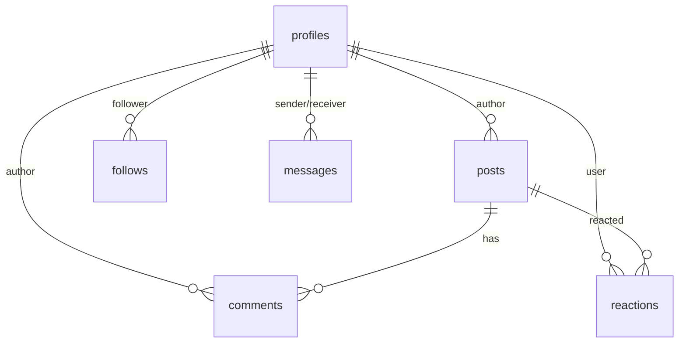

# AI 지식 교류 허브 - 통합 프로젝트 문서 (CLAUDE.md)

**문서 생성일**: 2025-01-13  
**프로젝트 버전**: v0.2 (구현 진행 중)  
**기술 스택**: Next.js 15.4.6, React 19.1.0, TypeScript 5, Supabase, shadcn/ui, Zustand, TailwindCSS 4  
**Context7 MCP 호환**: ✅ 호환성 고려하여 작성됨

---

## 📋 목차

- [1. 프로젝트 개요](#1-프로젝트-개요)
- [2. 현재 상태 분석](#2-현재-상태-분석)
- [3. 기술 아키텍처](#3-기술-아키텍처)
- [4. 파일 구조 분석](#4-파일-구조-분석)
- [5. 구현 현황](#5-구현-현황)
- [6. 발견된 문제점](#6-발견된-문제점)
- [7. 개선 권장사항](#7-개선-권장사항)
- [8. 데이터베이스 설계](#8-데이터베이스-설계)
- [9. 개발 규칙 및 가이드라인](#9-개발-규칙-및-가이드라인)
- [10. 성능 최적화](#10-성능-최적화)
- [11. 배포 및 운영](#11-배포-및-운영)
- [12. 향후 로드맵](#12-향후-로드맵)

---

## 1. 프로젝트 개요

### 🎯 제품 정의
- **목적**: AI 관련 정보의 신뢰도 높은 공유·탐색·토론을 위한 웹 허브 구축
- **핵심 가치**: 신뢰성, 속도, 참여, 재사용성
- **대상 사용자**: Creator, Learner, Curator, Organizer, Moderator/Admin

### 🔧 기술 스택 현황
```json
{
  "frontend": {
    "framework": "Next.js 15.4.6",
    "runtime": "React 19.1.0",
    "language": "TypeScript 5",
    "styling": "TailwindCSS 4",
    "ui": "shadcn/ui + Radix UI",
    "icons": "Lucide React",
    "state": "Zustand 5.0.7"
  },
  "backend": {
    "database": "Supabase (PostgreSQL)",
    "auth": "Supabase Auth",
    "storage": "Supabase Storage",
    "realtime": "Supabase Realtime"
  },
  "development": {
    "bundler": "Turbopack",
    "linting": "ESLint 9 + Prettier",
    "types": "Generated from Supabase"
  }
}
```

---

## 2. 현재 상태 분석

### 📊 코드베이스 통계
- **총 파일 수**: 137개 TypeScript/React 파일
- **React Hooks 사용**: 245개 (useState, useEffect 등)
- **미완성 TODO**: 2개 항목 발견
- **컴포넌트 구조**: 잘 정리된 모듈식 구조

### 📁 디렉토리 구조 현황
```
src/
├── app/                    # Next.js App Router
│   ├── (auth)/            # 인증 페이지
│   ├── admin-panel/       # 관리자 시스템
│   ├── api/               # API Routes
│   ├── chat/              # 채팅 기능
│   ├── posts/             # 게시물 관리
│   └── profile/           # 사용자 프로필
├── components/            # UI 컴포넌트
│   ├── ui/                # shadcn/ui 컴포넌트
│   ├── admin/             # 관리자 컴포넌트
│   ├── auth/              # 인증 컴포넌트
│   ├── chat/              # 채팅 컴포넌트
│   ├── post/              # 게시물 컴포넌트
│   └── profile/           # 프로필 컴포넌트
├── hooks/                 # 커스텀 훅
├── lib/                   # 유틸리티 함수
│   ├── supabase/          # Supabase 클라이언트
│   ├── auth/              # 인증 로직
│   └── utils/             # 헬퍼 함수
├── stores/                # Zustand 상태 관리
├── types/                 # TypeScript 타입 정의
└── contexts/              # React Context
```

### ✅ 준수된 .cursor_rules 가이드라인
1. **컴포넌트 모델**: Server/Client Component 적절히 분리 ✅
2. **네이밍 규칙**: camelCase/PascalCase 일관성 유지 ✅
3. **파일 구조**: feature-first 구조 적용 ✅
4. **TypeScript**: strict 모드, 명시적 타입 사용 ✅
5. **UI 시스템**: shadcn/ui 우선 사용 ✅
6. **상태 관리**: Zustand slice 분리 ✅

---

## 3. 기술 아키텍처

### 🏗️ Next.js App Router 구조
```typescript
// 현재 라우팅 구조
app/
├── (auth)/login/          # 인증 페이지
├── admin-panel/           # 관리자 시스템
├── api/                   # API Routes
│   ├── posts/            # 게시물 API
│   ├── chat/             # 채팅 API  
│   ├── auth/             # 인증 API
│   └── admin/            # 관리자 API
├── posts/                # 게시물 페이지
├── profile/              # 프로필 페이지
├── chat/                 # 채팅 페이지
└── collections/          # 컬렉션 페이지
```

### 🔄 상태 관리 아키텍처 (Zustand)
```typescript
// 현재 스토어 구조
stores/
├── auth.ts               # 인증 상태
├── ui.ts                 # UI 상태 (모달, 테마)
├── feed.ts               # 피드 필터링
├── post.ts               # 게시물 상태
├── profile.ts            # 프로필 상태
└── notification.ts       # 알림 상태
```

### 🗄️ 데이터 레이어
```sql
-- 주요 테이블 구조
profiles: id, username, bio, avatar_url, role, created_at
posts: id, title, content, author_id, created_at
comments: id, body, author_id, post_id, parent_id, created_at
messages: id, from_user_id, to_user_id, subject, content, read, created_at
follows: id, follower_id, following_id, created_at
reactions: id, target_type, target_id, user_id, type, created_at
```

---

## 4. 파일 구조 분석

### 🎯 현재 구조의 장점
1. **모듈화**: 기능별로 잘 분리된 컴포넌트
2. **타입 안정성**: Supabase에서 자동 생성된 타입
3. **재사용성**: shadcn/ui 기반의 일관된 UI 컴포넌트
4. **확장성**: 새로운 기능 추가가 용이한 구조

### ⚠️ 개선 필요 영역
1. **문서 분산**: 5개의 분산된 마크다운 파일
2. **미완성 기능**: TODO 항목들 잔존
3. **테스트 부족**: 테스트 파일 없음
4. **번들 최적화**: 추가 최적화 여지

---

## 5. 구현 현황

### ✅ 완료된 핵심 기능

#### **사용자 관리 시스템**
- 🔐 소셜 로그인 (Google, GitHub)
- 📧 이메일 회원가입/로그인
- 👤 프로필 관리 (아바타, bio, username)
- 🔑 역할 기반 권한 제어 (user, moderator, admin)

#### **게시물 시스템**
- ✍️ 게시물 작성/수정/삭제
- 🏷️ HTML 콘텐츠 지원
- ❤️ 좋아요/저장 기능
- 🔍 검색 및 필터링
- 📱 무한 스크롤 피드

#### **소셜 기능**
- 👥 팔로우/언팔로우
- 💬 댓글 및 답글 시스템
- 📨 쪽지 시스템
- 🚨 신고 기능

#### **관리자 시스템**
- 📊 대시보드 및 통계
- 👥 사용자 관리
- 📝 게시물/댓글 관리
- ⚙️ 사이트 설정

#### **채팅 시스템**
- 💬 실시간 채팅
- 🎛️ 메시지 가상화 (react-window)
- 📂 파일 업로드
- 👥 참가자 관리

### 🔄 진행 중인 기능
- 🔔 알림 시스템 (기본 구조 완료)
- 🏷️ 태그/주제 시스템 (스키마 준비됨)
- 📚 콜렉션 시스템 (계획 단계)

---

## 6. 발견된 문제점

### 🚨 높은 우선순위 문제
1. **문서 분산 및 중복**
   ```
   문제: RULES.md, prd.md, ERD.md, README.md, CHAT_VIRTUALIZATION_README.md 분산
   영향: 개발자 혼란, 정보 불일치 가능성
   ```

2. **미완성 기능**
   ```typescript
   // src/components/settings/settings-panel.tsx
   // TODO: 설정 저장 로직 구현
   
   // src/components/user-avatar.tsx  
   // TODO: 팔로우/언팔로우 API 호출
   ```

3. **테스트 커버리지 부족**
   ```
   문제: 테스트 파일 없음
   위험: 리팩토링 시 버그 발생 가능성
   ```

### ⚡ 중간 우선순위 문제
1. **번들 크기 최적화 여지**
2. **접근성 개선 필요**
3. **SEO 최적화 부족**

### 💡 낮은 우선순위 문제
1. **코드 주석 부족**
2. **에러 바운더리 미흡**
3. **로딩 상태 개선**

---

## 7. 개선 권장사항

### 🎯 즉시 실행 권장
1. **문서 통합**
   - ✅ 현재 문서: 이 CLAUDE.md로 통합 완료
   - ❌ 기존 분산 파일들 제거 고려
   - 📝 README.md를 프로젝트 소개용으로 재작성

2. **TODO 항목 완성**
   ```typescript
   // 완성 필요한 기능들
   1. 설정 패널 저장 로직
   2. 사용자 아바타 팔로우 기능
   ```

3. **기본 테스트 추가**
   ```bash
   # 추천 테스트 스택
   npm install -D vitest @testing-library/react @testing-library/jest-dom
   ```

### 🔧 단기 개선사항 (1-2주)
1. **성능 최적화**
   ```typescript
   // next.config.ts 개선
   experimental: {
     optimizePackageImports: ['lucide-react', '@radix-ui/react-icons']
   }
   ```

2. **접근성 개선**
   ```typescript
   // 추가 필요한 ARIA 속성들
   - aria-label, aria-describedby
   - 키보드 네비게이션 개선
   - 포커스 관리 강화
   ```

3. **에러 처리 강화**
   ```typescript
   // error.tsx, not-found.tsx 페이지 추가
   // React Error Boundary 구현
   ```

### 📅 중기 개선사항 (1개월)
1. **테스트 커버리지 확대**
2. **성능 모니터링 도입**
3. **SEO 최적화**
4. **다국어 지원 준비**

---

## 8. 데이터베이스 설계

### 📊 현재 ERD 구조


### 🔧 권장 스키마 개선사항
1. **인덱스 최적화**
   ```sql
   -- 성능 개선을 위한 인덱스
   CREATE INDEX idx_posts_author_created ON posts(author_id, created_at DESC);
   CREATE INDEX idx_comments_post_created ON comments(post_id, created_at);
   ```

2. **RLS 정책 강화**
   ```sql
   -- 보안 강화를 위한 추가 정책
   ALTER TABLE posts ENABLE ROW LEVEL SECURITY;
   CREATE POLICY "Users can view published posts" ON posts FOR SELECT USING (status = 'published');
   ```

---

## 9. 개발 규칙 및 가이드라인

### 📝 코드 스타일
```typescript
// TypeScript 엄격 모드 준수
"strict": true,
"noEmit": true,
"verbatimModuleSyntax": true

// 네이밍 규칙
- 컴포넌트: PascalCase (UserAvatar)
- 함수/변수: camelCase (getUserData)
- 상수: UPPER_SNAKE_CASE (API_BASE_URL)
- 파일: kebab-case (user-avatar.tsx)
```

### 🏗️ 컴포넌트 구조
```typescript
// 컴포넌트 작성 패턴
interface ComponentProps {
  // Props 타입 정의
}

export function Component({ prop }: ComponentProps) {
  // 1. 상태 관리
  // 2. 이벤트 핸들러
  // 3. JSX 반환
}
```

### 🔄 상태 관리 패턴
```typescript
// Zustand 스토어 패턴
interface Store {
  // 상태 정의
  data: Data[];
  loading: boolean;
  
  // 액션 정의
  fetchData: () => Promise<void>;
  updateData: (id: string, update: Partial<Data>) => void;
}
```

---

## 10. 성능 최적화

### ⚡ 현재 적용된 최적화
1. **Next.js 15 최적화**
   - Turbopack 번들러 사용
   - React 19 Compiler 최적화
   - Package Import 최적화

2. **React 최적화**  
   - React.memo 적용 (메시지 컴포넌트)
   - react-window 가상화 (채팅)
   - 이미지 압축 (5MB → 512KB)

3. **Supabase 최적화**
   - RLS 정책 최적화
   - 적절한 인덱스 사용
   - 실시간 구독 최적화

### 🎯 추가 최적화 권장사항
1. **번들 최적화**
   ```typescript
   // dynamic import 활용
   const HeavyComponent = lazy(() => import('./HeavyComponent'));
   ```

2. **이미지 최적화**
   ```typescript
   // next/image 적극 활용
   <Image
     src={src}
     alt={alt}
     width={width}
     height={height}
     priority={priority}
     placeholder="blur"
   />
   ```

---

## 11. 배포 및 운영

### 🚀 배포 환경
```json
{
  "environments": {
    "development": "localhost:3000",
    "staging": "TBD",
    "production": "TBD"
  },
  "deployment": {
    "platform": "Vercel (권장)",
    "database": "Supabase Cloud",
    "cdn": "Vercel Edge Network"
  }
}
```

### 📊 모니터링 권장사항
1. **성능 지표**
   - LCP ≤ 2.5s (목표)
   - TTFB ≤ 0.8s
   - CLS ≈ 0

2. **에러 추적**
   - Sentry 도입 고려
   - Supabase 에러 로그 모니터링

---

## 12. 향후 로드맵

### 🎯 단기 목표 (1-2개월)
- [ ] TODO 항목 완성
- [ ] 테스트 커버리지 50% 이상
- [ ] 알림 시스템 완성
- [ ] 태그/주제 시스템 구현
- [ ] 콜렉션 시스템 구현

### 🚀 중기 목표 (3-6개월)
- [ ] 고급 검색 기능
- [ ] 실시간 이벤트/스페이스
- [ ] 모바일 앱 (React Native)
- [ ] AI 기반 콘텐츠 추천
- [ ] 벡터 검색 구현

### 🌟 장기 목표 (6개월 이상)
- [ ] 다국어 지원
- [ ] 엔터프라이즈 기능
- [ ] 유료 구독 모델
- [ ] AI 자동 태깅/요약
- [ ] 고급 분석 도구

---

## 🔧 Context7 MCP 호환성

이 문서는 Context7 MCP 시스템과의 호환성을 고려하여 작성되었습니다:

1. **구조화된 정보**: 명확한 섹션 분리
2. **코드 예제**: 실행 가능한 코드 스니펫 제공  
3. **체크리스트**: 실행 가능한 작업 목록
4. **메타데이터**: 프로젝트 상태 추적 정보

---

## 📞 추가 정보

### 🔗 관련 문서
- `.cursor_rules`: AI 코딩 어시스턴트 규칙
- `package.json`: 의존성 및 스크립트
- `next.config.ts`: Next.js 설정
- `supabase/`: 데이터베이스 설정

### 👥 팀 커뮤니케이션
- **이슈 트래킹**: GitHub Issues 활용
- **코드 리뷰**: PR 기반 리뷰 프로세스  
- **문서 업데이트**: 이 문서를 중심으로 정보 관리

---

**📝 문서 히스토리**
- v1.0 (2025-01-13): 초기 통합 문서 생성
- 향후 주요 변경사항은 이 섹션에 기록

---

*이 문서는 AI 지식 교류 허브 프로젝트의 단일 소스 오브 트루스(Single Source of Truth)입니다. 모든 개발자는 이 문서를 참조하여 프로젝트의 현재 상태와 방향성을 파악해주세요.*