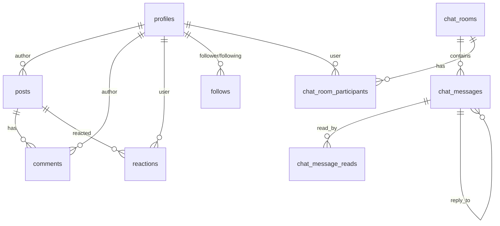

# 데이터베이스 설계

**문서 업데이트**: 2025-10-04

---

## ERD (Entity Relationship Diagram)



---

## 주요 테이블 스키마

### profiles (사용자 프로필)

```sql
CREATE TABLE profiles (
  id UUID PRIMARY KEY REFERENCES auth.users,
  username TEXT UNIQUE,
  bio TEXT,
  avatar_url TEXT,
  cover_url TEXT,
  role TEXT DEFAULT 'user',
  created_at TIMESTAMPTZ DEFAULT NOW()
);
```

### posts (게시물)

```sql
CREATE TABLE posts (
  id UUID PRIMARY KEY DEFAULT uuid_generate_v4(),
  title TEXT NOT NULL,
  content TEXT,
  author_id UUID REFERENCES profiles(id),
  pin_scope TEXT,
  pin_priority INT,
  pinned_until TIMESTAMPTZ,
  is_notice BOOLEAN DEFAULT false,
  created_at TIMESTAMPTZ DEFAULT NOW()
);
```

### chat_rooms (채팅방)

```sql
CREATE TABLE chat_rooms (
  id UUID PRIMARY KEY DEFAULT uuid_generate_v4(),
  name TEXT,
  type TEXT DEFAULT 'dm',  -- 'dm' | 'group'
  created_by UUID REFERENCES profiles(id),
  created_at TIMESTAMPTZ DEFAULT NOW(),
  updated_at TIMESTAMPTZ DEFAULT NOW()
);
```

### chat_messages (채팅 메시지)

```sql
CREATE TABLE chat_messages (
  id UUID PRIMARY KEY DEFAULT uuid_generate_v4(),
  room_id UUID REFERENCES chat_rooms(id) ON DELETE CASCADE,
  sender_id UUID REFERENCES profiles(id),
  content TEXT,
  message_type TEXT DEFAULT 'text',  -- 'text' | 'image' | 'file' | 'location'
  file_url TEXT,
  file_name TEXT,
  file_size BIGINT,
  reply_to_id UUID REFERENCES chat_messages(id),
  created_at TIMESTAMPTZ DEFAULT NOW()
);
```

### chat_message_reads (읽음 상태)

```sql
CREATE TABLE chat_message_reads (
  id UUID PRIMARY KEY DEFAULT uuid_generate_v4(),
  message_id UUID REFERENCES chat_messages(id) ON DELETE CASCADE,
  user_id UUID REFERENCES profiles(id) ON DELETE CASCADE,
  read_at TIMESTAMPTZ DEFAULT NOW(),
  UNIQUE(message_id, user_id)
);
```

---

## RLS (Row Level Security) 정책

### profiles

```sql
-- 모두 읽기 가능
CREATE POLICY "Profiles are viewable by everyone"
  ON profiles FOR SELECT USING (true);

-- 본인만 수정
CREATE POLICY "Users can update own profile"
  ON profiles FOR UPDATE USING (auth.uid() = id);
```

### chat_rooms

```sql
-- 참가자만 조회
CREATE POLICY "Users can view rooms they participate in"
  ON chat_rooms FOR SELECT USING (
    EXISTS (
      SELECT 1 FROM chat_room_participants
      WHERE room_id = chat_rooms.id
      AND user_id = auth.uid()
    )
  );
```

### chat_messages

```sql
-- 참가자만 읽기
CREATE POLICY "Users can view messages in their rooms"
  ON chat_messages FOR SELECT USING (
    EXISTS (
      SELECT 1 FROM chat_room_participants
      WHERE room_id = chat_messages.room_id
      AND user_id = auth.uid()
    )
  );

-- 참가자만 쓰기
CREATE POLICY "Users can insert messages in their rooms"
  ON chat_messages FOR INSERT WITH CHECK (
    sender_id = auth.uid() AND
    EXISTS (
      SELECT 1 FROM chat_room_participants
      WHERE room_id = chat_messages.room_id
      AND user_id = auth.uid()
    )
  );
```

---

## 인덱스 최적화

```sql
-- 채팅 메시지 조회 성능
CREATE INDEX idx_chat_messages_room_created
  ON chat_messages(room_id, created_at DESC);

-- 사용자별 채팅방 조회
CREATE INDEX idx_chat_participants_user
  ON chat_room_participants(user_id);

-- 게시물 검색
CREATE INDEX idx_posts_title
  ON posts USING gin(to_tsvector('korean', title));
```

---

## 마이그레이션

마이그레이션 파일 위치: `supabase/migrations/`

### 주요 마이그레이션

- `add_location_message_type.sql`: location 메시지 타입 추가
- `create_chat_tables.sql`: 채팅 시스템 테이블 생성
- `add_rls_policies.sql`: RLS 정책 추가

---

[← 기능 상세](FEATURES.md) | [문제 해결 →](TROUBLESHOOTING.md)
