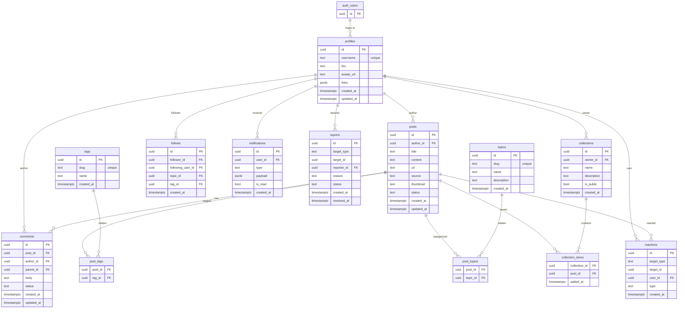

## ERD (초안)

```mermaid
erDiagram
  auth_users ||--o{ profiles : "maps to"
  profiles ||--o{ posts : "author"
  profiles ||--o{ comments : "author"
  profiles ||--o{ reactions : "user"
  profiles ||--o{ collections : "owner"
  profiles ||--o{ follows : "follower"
  profiles ||--o{ notifications : "receiver"
  profiles ||--o{ reports : "reporter"

  posts ||--o{ comments : "has"
  posts ||--o{ post_tags : "tagged"
  posts ||--o{ post_topics : "categorized"
  posts ||--o{ collection_items : "saved"
  posts ||--o{ reactions : "reacted"

  topics ||--o{ post_topics : "relates"
  tags ||--o{ post_tags : "relates"
  collections ||--o{ collection_items : "contains"

  auth_users {
    uuid id PK
  }
  profiles {
    uuid id PK
    text username "unique"
    text bio
    text avatar_url
    jsonb links
    timestamptz created_at
    timestamptz updated_at
  }
  topics {
    uuid id PK
    text slug "unique"
    text name
    text description
    timestamptz created_at
  }
  tags {
    uuid id PK
    text slug "unique"
    text name
    timestamptz created_at
  }
  posts {
    uuid id PK
    uuid author_id FK
    text title
    text content
    text url
    text source
    text thumbnail
    text status
    timestamptz created_at
    timestamptz updated_at
  }
  post_topics {
    uuid post_id FK
    uuid topic_id FK
  }
  post_tags {
    uuid post_id FK
    uuid tag_id FK
  }
  comments {
    uuid id PK
    uuid post_id FK
    uuid author_id FK
    uuid parent_id FK
    text body
    text status
    timestamptz created_at
    timestamptz updated_at
  }
  reactions {
    uuid id PK
    text target_type
    uuid target_id
    uuid user_id FK
    text type
    timestamptz created_at
  }
  collections {
    uuid id PK
    uuid owner_id FK
    text name
    text description
    bool is_public
    timestamptz created_at
  }
  collection_items {
    uuid collection_id FK
    uuid post_id FK
    timestamptz added_at
  }
  follows {
    uuid id PK
    uuid follower_id FK
    uuid following_user_id FK
    uuid topic_id FK
    uuid tag_id FK
    timestamptz created_at
  }
  notifications {
    uuid id PK
    uuid user_id FK
    text type
    jsonb payload
    bool is_read
    timestamptz created_at
  }
  reports {
    uuid id PK
    text target_type
    uuid target_id
    uuid reporter_id FK
    text reason
    text status
    timestamptz created_at
    timestamptz resolved_at
  }
```
