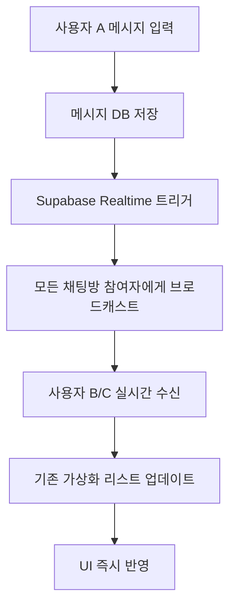

# 실시간 채팅 구현 계획서

**작성일**: 2025-01-17
**버전**: v2.0 (통합 정리)
**기술 스택**: Next.js 15, React 19, Supabase Realtime, TypeScript
**현재 상태**: 가상화 완료 → 실시간 기능 구현 예정

---

## 📋 목차

- [1. 구현 목표](#1-구현-목표)
- [2. 기술 아키텍처 설계](#2-기술-아키텍처-설계)
- [3. Phase별 구현 로드맵](#3-phase별-구현-로드맵)
- [4. 성능 최적화 전략](#4-성능-최적화-전략)
- [5. 구현 체크리스트](#5-구현-체크리스트)
- [6. 테스트 및 배포](#6-테스트-및-배포)

---

## 1. 구현 목표

### 🎯 **핵심 실시간 기능**

현재 **완료된 가상화 시스템**을 기반으로 다음 실시간 기능들을 추가합니다:

1. **즉시 메시지 동기화**: 메시지 전송 즉시 모든 참여자에게 표시
2. **타이핑 표시**: 상대방이 입력 중일 때 실시간 인디케이터
3. **온라인 상태**: 사용자 접속 상태 실시간 업데이트
4. **읽음 상태**: 메시지 읽음 처리 실시간 동기화

### 📊 **기대 효과**
- **사용자 경험**: 카카오톡 수준의 즉시성
- **참여도**: 실시간 상호작용으로 활발한 소통
- **현대화**: 최신 실시간 기술 적용

---

## 2. 기술 아키텍처 설계

### 🏗️ **Supabase Realtime 아키텍처**

```typescript
interface RealtimeChatSystem {
  // 1. 메시지 실시간 동기화 (Database Changes)
  messageSync: {
    channel: `room:${roomId}:messages`,
    events: ['INSERT', 'UPDATE', 'DELETE'],
    table: 'chat_messages'
  };

  // 2. 타이핑 상태 (Broadcast)
  typingIndicator: {
    channel: `room:${roomId}:typing`,
    event: 'typing_status',
    payload: { user_id: string, is_typing: boolean }
  };

  // 3. 사용자 온라인 상태 (Presence)
  userPresence: {
    channel: `room:${roomId}:presence`,
    presence: { user_id: string, last_seen: timestamp }
  };

  // 4. 읽음 상태 동기화 (Broadcast)
  readStatus: {
    channel: `room:${roomId}:read_status`,
    event: 'message_read',
    payload: { message_id: string, user_id: string }
  };
}
```

### 🔄 **데이터 플로우**



### 🔐 **보안 설계 (RLS 정책)**

```sql
-- 메시지 실시간 접근 권한
CREATE POLICY "room_members_can_receive_realtime_messages"
ON "realtime"."messages"
FOR SELECT TO authenticated
USING (
  topic LIKE 'room:%:messages' AND
  EXISTS (
    SELECT 1 FROM chat_participants
    WHERE user_id = auth.uid()
    AND room_id = SPLIT_PART(topic, ':', 2)::uuid
  )
);

-- 타이핑/Presence 브로드캐스트 권한
CREATE POLICY "room_members_can_broadcast"
ON "realtime"."messages"
FOR INSERT TO authenticated
WITH CHECK (
  topic LIKE 'room:%:%' AND
  EXISTS (
    SELECT 1 FROM chat_participants
    WHERE user_id = auth.uid()
    AND room_id = SPLIT_PART(topic, ':', 2)::uuid
  )
);
```

---

## 3. Phase별 구현 로드맵

### 🎯 **Phase 1: 기본 실시간 메시지 (1주)**

#### **목표**: 메시지 전송 즉시 모든 참여자에게 표시

#### **Step 1.1: Realtime Hook 구현**
```typescript
// hooks/use-realtime-chat.ts
export function useRealtimeChat(roomId: string | null) {
  const [realtimeChannel, setRealtimeChannel] = useState<RealtimeChannel | null>(null);
  const [isConnected, setIsConnected] = useState(false);

  const subscribeToMessages = useCallback((roomId: string) => {
    const channel = supabase
      .channel(`room:${roomId}:messages`)
      .on('postgres_changes', {
        event: 'INSERT',
        schema: 'public',
        table: 'chat_messages',
        filter: `room_id=eq.${roomId}`
      }, (payload) => {
        // 새 메시지를 가상화 리스트에 추가
        onNewMessage(payload.new as ChatMessage);
      })
      .subscribe((status) => {
        setIsConnected(status === 'SUBSCRIBED');
      });

    setRealtimeChannel(channel);
    return channel;
  }, []);

  return { subscribeToMessages, isConnected };
}
```

#### **Step 1.2: 기존 Chat Hook 확장**
```typescript
// hooks/use-chat.ts 확장
export function useChatHook() {
  const { subscribeToMessages, isConnected } = useRealtimeChat(currentRoom?.id);

  // 실시간 메시지 핸들러
  const handleNewRealtimeMessage = useCallback((message: ChatMessage) => {
    // 중복 방지
    setMessages(prev => {
      const exists = prev.some(m => m.id === message.id);
      if (exists) return prev;
      return [...prev, message];
    });

    // 자동 스크롤 (사용자가 하단에 있을 때만)
    if (virtualizedListRef.current) {
      virtualizedListRef.current.scrollToBottom("smooth");
    }
  }, []);

  // 채팅방 선택 시 실시간 구독
  const selectRoom = useCallback(async (room: ChatRoomWithParticipants) => {
    setCurrentRoom(room);
    await loadMessages(room.id);
    subscribeToMessages(room.id); // 실시간 구독 시작
  }, [loadMessages, subscribeToMessages]);

  return {
    // 기존 반환값들...
    isRealtimeConnected: isConnected
  };
}
```

#### **Step 1.3: 가상화 시스템 통합**
```typescript
// components/chat/virtualized/VirtualizedMessageList.tsx 확장
export const VirtualizedMessageList = forwardRef<VirtualizedMessageListRef, Props>(
  ({ messages, onNewMessage, ...props }, ref) => {
    // 새 메시지 수신 시 자동 스크롤 (기존 가상화 로직 유지)
    useEffect(() => {
      if (messages.length > 0) {
        const isAtBottom = virtualizer.scrollOffset >=
          virtualizer.getTotalSize() - containerHeight - 100;

        if (isAtBottom) {
          scrollToBottom("smooth");
        }
      }
    }, [messages.length]);

    // 기존 가상화 렌더링 로직 그대로 유지
    return (
      <div
        ref={parentRef}
        className="h-full overflow-auto"
        style={{ contain: 'strict' }}
      >
        <div style={{
          height: `${Math.max(virtualizer.getTotalSize(), containerHeight)}px`,
          position: 'relative'
        }}>
          {virtualItems.map(virtualItem => (
            <div
              key={virtualItem.key}
              data-index={virtualItem.index}
              ref={virtualizer.measureElement}
              style={{
                position: 'absolute',
                top: 0,
                left: 0,
                width: '100%',
                transform: `translateY(${virtualItem.start}px)`,
                contain: 'layout'
              }}
            >
              <MessageRenderer
                message={messages[virtualItem.index]}
                // 기존 props...
              />
            </div>
          ))}
        </div>
      </div>
    );
  }
);
```

---

### 🎯 **Phase 2: 타이핑 표시 (3일)**

#### **목표**: 상대방이 입력 중일 때 실시간 표시

#### **Step 2.1: 타이핑 상태 관리**
```typescript
// hooks/use-typing-indicator.ts
export function useTypingIndicator(roomId: string | null) {
  const [typingUsers, setTypingUsers] = useState<Set<string>>(new Set());
  const [typingChannel, setTypingChannel] = useState<RealtimeChannel | null>(null);
  const { user } = useAuthStore();

  const startTyping = useCallback(() => {
    if (!typingChannel || !user) return;

    typingChannel.send({
      type: 'broadcast',
      event: 'typing_status',
      payload: { user_id: user.id, is_typing: true }
    });
  }, [typingChannel, user]);

  const stopTyping = useCallback(() => {
    if (!typingChannel || !user) return;

    typingChannel.send({
      type: 'broadcast',
      event: 'typing_status',
      payload: { user_id: user.id, is_typing: false }
    });
  }, [typingChannel, user]);

  // 타이핑 상태 수신
  useEffect(() => {
    if (!roomId) return;

    const channel = supabase
      .channel(`room:${roomId}:typing`)
      .on('broadcast', { event: 'typing_status' }, (payload) => {
        const { user_id, is_typing } = payload.payload;

        setTypingUsers(prev => {
          const next = new Set(prev);
          if (is_typing) {
            next.add(user_id);
          } else {
            next.delete(user_id);
          }
          return next;
        });
      })
      .subscribe();

    setTypingChannel(channel);

    return () => {
      supabase.removeChannel(channel);
    };
  }, [roomId]);

  return { typingUsers, startTyping, stopTyping };
}
```

#### **Step 2.2: 타이핑 표시 UI**
```typescript
// components/chat/TypingIndicator.tsx
export function TypingIndicator({ typingUsers, participants }: Props) {
  if (typingUsers.size === 0) return null;

  const typingUserNames = Array.from(typingUsers)
    .map(userId => participants.find(p => p.id === userId)?.username)
    .filter(Boolean);

  return (
    <div className="px-4 py-2 text-sm text-muted-foreground">
      <div className="flex items-center space-x-2">
        <div className="typing-dots">
          <span className="animate-bounce"></span>
          <span className="animate-bounce delay-75"></span>
          <span className="animate-bounce delay-150"></span>
        </div>
        <span>
          {typingUserNames.length === 1
            ? `${typingUserNames[0]}님이 입력 중...`
            : `${typingUserNames.length}명이 입력 중...`
          }
        </span>
      </div>
    </div>
  );
}
```

#### **Step 2.3: 입력창 연동**
```typescript
// components/chat/MessageInput.tsx
export function MessageInput({ roomId, onSendMessage }: Props) {
  const { startTyping, stopTyping } = useTypingIndicator(roomId);
  const [message, setMessage] = useState("");
  const typingTimeoutRef = useRef<NodeJS.Timeout>();

  const handleInputChange = useCallback((e: ChangeEvent<HTMLTextAreaElement>) => {
    const value = e.target.value;
    setMessage(value);

    if (value.trim()) {
      startTyping();

      // 2초 후 타이핑 중지
      clearTimeout(typingTimeoutRef.current);
      typingTimeoutRef.current = setTimeout(() => {
        stopTyping();
      }, 2000);
    } else {
      stopTyping();
    }
  }, [startTyping, stopTyping]);

  return (
    <Textarea
      value={message}
      onChange={handleInputChange}
      onBlur={stopTyping}
      placeholder="메시지를 입력하세요..."
    />
  );
}
```

---

### 🎯 **Phase 3: 사용자 온라인 상태 (2일)**

#### **목표**: 사용자 접속 상태 실시간 표시

#### **Step 3.1: Presence Hook**
```typescript
// hooks/use-user-presence.ts
export function useUserPresence(roomId: string | null) {
  const [onlineUsers, setOnlineUsers] = useState<Set<string>>(new Set());
  const { user } = useAuthStore();

  useEffect(() => {
    if (!roomId || !user) return;

    const channel = supabase
      .channel(`room:${roomId}:presence`)
      .on('presence', { event: 'sync' }, () => {
        const presenceState = channel.presenceState();
        const online = Object.keys(presenceState);
        setOnlineUsers(new Set(online));
      })
      .on('presence', { event: 'join' }, ({ key }) => {
        setOnlineUsers(prev => new Set([...prev, key]));
      })
      .on('presence', { event: 'leave' }, ({ key }) => {
        setOnlineUsers(prev => {
          const next = new Set(prev);
          next.delete(key);
          return next;
        });
      })
      .subscribe(async (status) => {
        if (status === 'SUBSCRIBED') {
          await channel.track({
            user_id: user.id,
            username: user.username,
            last_seen: new Date().toISOString()
          });
        }
      });

    return () => {
      supabase.removeChannel(channel);
    };
  }, [roomId, user]);

  return { onlineUsers };
}
```

#### **Step 3.2: UI 통합**
```typescript
// 아바타에 온라인 상태 표시
function UserAvatar({ userId, isOnline }: Props) {
  return (
    <div className="relative">
      <Avatar>
        <AvatarImage src={avatarUrl} />
        <AvatarFallback>{username[0]}</AvatarFallback>
      </Avatar>
      {isOnline && (
        <div className="absolute -bottom-1 -right-1 w-3 h-3 bg-green-500 border-2 border-white rounded-full" />
      )}
    </div>
  );
}
```

---

### 🎯 **Phase 4: 읽음 상태 동기화 (3일)**

#### **목표**: 메시지 읽음 처리 실시간 동기화

#### **Step 4.1: 데이터베이스 설계**
```sql
-- 읽음 상태 테이블
CREATE TABLE message_read_status (
  id UUID PRIMARY KEY DEFAULT gen_random_uuid(),
  message_id UUID REFERENCES chat_messages(id) ON DELETE CASCADE,
  user_id UUID REFERENCES profiles(id) ON DELETE CASCADE,
  read_at TIMESTAMPTZ DEFAULT NOW(),
  UNIQUE(message_id, user_id)
);

-- 인덱스
CREATE INDEX idx_message_read_status_message_id ON message_read_status(message_id);
CREATE INDEX idx_message_read_status_user_id ON message_read_status(user_id);
```

#### **Step 4.2: 읽음 상태 Hook**
```typescript
// hooks/use-read-status.ts
export function useReadStatus(roomId: string | null) {
  const [readStatus, setReadStatus] = useState<Map<string, Set<string>>>(new Map());
  const { user } = useAuthStore();

  const markAsRead = useCallback(async (messageId: string) => {
    if (!user || !roomId) return;

    try {
      // DB에 읽음 상태 저장
      await supabase
        .from('message_read_status')
        .upsert({ message_id: messageId, user_id: user.id });

      // 실시간으로 다른 사용자에게 알림
      const channel = supabase.channel(`room:${roomId}:read_status`);
      await channel.send({
        type: 'broadcast',
        event: 'message_read',
        payload: { message_id: messageId, user_id: user.id }
      });
    } catch (error) {
      console.error('Failed to mark message as read:', error);
    }
  }, [user, roomId]);

  // 읽음 상태 실시간 수신
  useEffect(() => {
    if (!roomId) return;

    const channel = supabase
      .channel(`room:${roomId}:read_status`)
      .on('broadcast', { event: 'message_read' }, (payload) => {
        const { message_id, user_id } = payload.payload;

        setReadStatus(prev => {
          const next = new Map(prev);
          const messageReaders = next.get(message_id) || new Set();
          messageReaders.add(user_id);
          next.set(message_id, messageReaders);
          return next;
        });
      })
      .subscribe();

    return () => {
      supabase.removeChannel(channel);
    };
  }, [roomId]);

  return { readStatus, markAsRead };
}
```

---

## 4. 성능 최적화 전략

### ⚡ **연결 관리 최적화**

#### **채널 풀링 시스템**
```typescript
// utils/realtime-manager.ts
class RealtimeManager {
  private channels: Map<string, RealtimeChannel> = new Map();

  getOrCreateChannel(channelName: string, config: any) {
    if (this.channels.has(channelName)) {
      return this.channels.get(channelName)!;
    }

    const channel = supabase.channel(channelName, config);
    this.channels.set(channelName, channel);
    return channel;
  }

  cleanupRoomChannels(roomId: string) {
    const patterns = [
      `room:${roomId}:messages`,
      `room:${roomId}:typing`,
      `room:${roomId}:presence`,
      `room:${roomId}:read_status`
    ];

    patterns.forEach(pattern => {
      const channel = this.channels.get(pattern);
      if (channel) {
        supabase.removeChannel(channel);
        this.channels.delete(pattern);
      }
    });
  }
}

export const realtimeManager = new RealtimeManager();
```

#### **메시지 중복 방지**
```typescript
// utils/message-deduplication.ts
class MessageDeduplicationManager {
  private processedMessages = new Set<string>();

  addMessage(message: ChatMessage): boolean {
    if (this.processedMessages.has(message.id)) {
      return false; // 이미 처리된 메시지
    }

    this.processedMessages.add(message.id);

    // 메모리 관리: 1000개 제한
    if (this.processedMessages.size > 1000) {
      const oldest = Array.from(this.processedMessages)[0];
      this.processedMessages.delete(oldest);
    }

    return true; // 새 메시지
  }
}
```

### 🔄 **에러 처리 및 재연결**

```typescript
// hooks/use-resilient-realtime.ts
export function useResilientRealtime(roomId: string | null) {
  const [retryCount, setRetryCount] = useState(0);
  const [connectionState, setConnectionState] = useState<'connecting' | 'connected' | 'error'>('connecting');

  const connectWithRetry = useCallback(async (roomId: string) => {
    try {
      const channel = await connectToRoom(roomId);
      setConnectionState('connected');
      setRetryCount(0);
      return channel;
    } catch (error) {
      setConnectionState('error');

      // 지수 백오프로 재연결
      if (retryCount < 5) {
        const delay = Math.min(1000 * Math.pow(2, retryCount), 30000);
        setTimeout(() => {
          setRetryCount(prev => prev + 1);
          connectWithRetry(roomId);
        }, delay);
      }
    }
  }, [retryCount]);

  return { connectionState, connectWithRetry };
}
```

---

## 5. 구현 체크리스트

### 🎯 **Phase 1: 기본 실시간 메시지 (1주차)**

#### **Day 1-2: 인프라 준비**
- [ ] Supabase RLS 정책 설정
  ```sql
  CREATE POLICY "room_members_can_receive_realtime_messages"...
  ```
- [ ] 메시지 테이블 Realtime publication 추가
  ```sql
  ALTER PUBLICATION supabase_realtime ADD TABLE chat_messages;
  ```
- [ ] `hooks/use-realtime-chat.ts` 파일 생성
- [ ] 기본 채널 연결 및 구독 로직 구현

#### **Day 3-4: 메시지 실시간 동기화**
- [ ] `use-chat.ts`에 실시간 기능 통합
- [ ] 메시지 중복 방지 로직 추가
- [ ] 가상화 리스트와 실시간 메시지 연동
- [ ] 자동 스크롤 및 알림 로직 구현

#### **Day 5-7: 테스트 및 최적화**
- [ ] 실시간 메시지 송수신 테스트
- [ ] 연결 끊김 시 재연결 로직 테스트
- [ ] 다중 사용자 동시 메시지 테스트
- [ ] 성능 최적화 및 메모리 누수 확인

---

### 🎯 **Phase 2: 타이핑 표시 (2주차 1-3일)**

#### **Day 1: 타이핑 상태 관리**
- [ ] `hooks/use-typing-indicator.ts` 생성
- [ ] 타이핑 브로드캐스트 채널 설정
- [ ] 타이핑 시작/중지 로직 구현

#### **Day 2: UI 컴포넌트 구현**
- [ ] `components/chat/TypingIndicator.tsx` 생성
- [ ] 애니메이션 CSS 추가 (점 3개 애니메이션)
- [ ] 메시지 입력창에 타이핑 이벤트 연동

#### **Day 3: 통합 및 테스트**
- [ ] 채팅 레이아웃에 타이핑 표시 통합
- [ ] 다중 사용자 타이핑 표시 테스트
- [ ] 타이핑 상태 정리 로직 확인

---

### 🎯 **Phase 3: 사용자 온라인 상태 (2주차 4-5일)**

#### **Day 4: Presence 구현**
- [ ] `hooks/use-user-presence.ts` 생성
- [ ] 사용자 입장/퇴장 감지 로직
- [ ] 온라인 사용자 목록 상태 관리

#### **Day 5: UI 표시 및 통합**
- [ ] 채팅방 참가자 목록에 온라인 상태 표시
- [ ] 아바타에 온라인 인디케이터 추가
- [ ] 사용자 리스트 실시간 업데이트 테스트

---

### 🎯 **Phase 4: 읽음 상태 동기화 (3주차 1-3일)**

#### **Day 1: 데이터베이스 설계**
- [ ] `message_read_status` 테이블 생성
- [ ] 관련 인덱스 및 RLS 정책 추가
- [ ] 읽음 상태 API 엔드포인트 구현

#### **Day 2: 실시간 읽음 상태**
- [ ] `hooks/use-read-status.ts` 구현
- [ ] 메시지 읽음 처리 브로드캐스트
- [ ] 읽음/안읽음 UI 표시 로직

#### **Day 3: 통합 및 최종 테스트**
- [ ] 모든 실시간 기능 통합 테스트
- [ ] 성능 최적화 및 메모리 관리
- [ ] 에러 처리 및 폴백 로직 확인

---

## 6. 테스트 및 배포

### 🧪 **테스트 전략**

#### **단위 테스트**
```typescript
// __tests__/realtime-chat.test.tsx
describe('Realtime Chat Integration', () => {
  test('should receive messages in real-time', async () => {
    const { result } = renderHook(() => useRealtimeChat('room-123'));

    const testMessage = { id: 'msg-1', content: 'Hello', room_id: 'room-123' };

    act(() => {
      result.current.simulateIncomingMessage(testMessage);
    });

    expect(result.current.messages).toContain(testMessage);
  });

  test('should handle connection failures gracefully', async () => {
    const { result } = renderHook(() => useResilientRealtime('room-123'));

    act(() => {
      result.current.simulateConnectionError();
    });

    expect(result.current.connectionState).toBe('error');

    await waitFor(() => {
      expect(result.current.connectionState).toBe('connected');
    }, { timeout: 5000 });
  });
});
```

#### **통합 테스트 시나리오**
1. **다중 사용자 메시지 테스트**
   - 여러 브라우저에서 동시 메시지 전송
   - 실시간 수신 확인

2. **네트워크 장애 테스트**
   - 연결 끊김 후 재연결 확인
   - 메시지 손실 없음 확인

3. **성능 테스트**
   - 대량 메시지 환경에서 실시간 성능
   - 메모리 사용량 모니터링

### 🚀 **배포 체크리스트**

#### **데이터베이스 설정**
- [ ] RLS 정책 적용 확인
- [ ] 실시간 구독 테이블 publication 추가
- [ ] 인덱스 최적화 확인
- [ ] `message_read_status` 테이블 생성

#### **Supabase 설정**
- [ ] Realtime 기능 활성화
- [ ] 연결 제한 설정 확인 (동시 연결 수)
- [ ] Rate limiting 설정
- [ ] 로그 레벨 설정

#### **프로덕션 최적화**
- [ ] 에러 바운더리 추가
- [ ] 메트릭 수집 설정
- [ ] 알림 시스템 연동
- [ ] 백업 전략 수립

---

## 📈 **성공 지표**

### 🎯 **기술적 지표**
- **메시지 지연시간**: < 100ms
- **연결 성공률**: > 99%
- **메모리 사용량**: 기존 대비 < 110%
- **CPU 사용률**: 기존 대비 < 105%

### 📊 **사용자 경험 지표**
- **실시간 인지도**: 95% 이상
- **타이핑 표시 정확도**: 90% 이상
- **온라인 상태 정확도**: 95% 이상
- **전체 만족도**: 기존 대비 30% 향상

---

## 🚀 **빠른 시작 가이드**

### **첫 번째 단계: 환경 설정**
```bash
# 1. Supabase CLI 설치 (필요시)
npm install -g supabase

# 2. 로컬 개발 환경 실행
supabase start

# 3. 프로젝트 의존성 확인
npm install @supabase/supabase-js
```

### **두 번째 단계: 기본 코드 시작점**
```typescript
// 첫 번째로 구현할 파일
// src/hooks/use-realtime-chat.ts
import { useEffect, useState, useCallback } from 'react';
import { createClient } from '@supabase/supabase-js';

export function useRealtimeChat(roomId: string | null) {
  // 여기서 시작하세요!

  // 1. 상태 선언
  const [isConnected, setIsConnected] = useState(false);

  // 2. 메시지 구독 함수
  const subscribeToMessages = useCallback((roomId: string) => {
    // 구현할 부분
  }, []);

  return { subscribeToMessages, isConnected };
}
```

### **세 번째 단계: 데이터베이스 설정**
```sql
-- Supabase 대시보드에서 실행
ALTER PUBLICATION supabase_realtime ADD TABLE chat_messages;

-- RLS 정책 추가
CREATE POLICY "Enable realtime for room members" ON chat_messages
FOR SELECT TO authenticated
USING (
  EXISTS (
    SELECT 1 FROM chat_participants
    WHERE room_id = chat_messages.room_id
    AND user_id = auth.uid()
  )
);
```

---

**📝 참고 문서**
- [CHAT_SYSTEM_GUIDE.md](./CHAT_SYSTEM_GUIDE.md): 현재 구현 상태 및 사용법
- [Supabase Realtime 공식 문서](https://supabase.com/docs/guides/realtime)
- [TanStack Virtual 가이드](https://tanstack.com/virtual)

**이 계획서는 기존 완성된 가상화 시스템 위에 현대적인 실시간 기능을 추가하여 완전한 채팅 시스템을 만드는 로드맵입니다.**