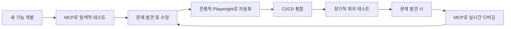

# MCP Playwright 사용법 가이드

**환경**: Windows 10 + WSL2 (Ubuntu 20.04) + X11 (VcXsrv) + Claude Code
**목적**: 실시간 브라우저 상호작용 및 탐색적 테스팅
**작성일**: 2025-01-18

---

## 📋 목차

- [1. MCP Playwright 개요](#1-mcp-playwright-개요)
- [2. 사전 준비사항](#2-사전-준비사항)
- [3. MCP 도구 설치](#3-mcp-도구-설치)
- [4. 기본 사용법](#4-기본-사용법)
- [5. 고급 기능](#5-고급-기능)
- [6. 실제 프로젝트 적용](#6-실제-프로젝트-적용)
- [7. 문제 해결](#7-문제-해결)
- [8. MCP vs 전통적 방식 비교](#8-mcp-vs-전통적-방식-비교)

---

## 1. MCP Playwright 개요

### 🎯 MCP Playwright란?

**MCP (Model Context Protocol) Playwright**는 Claude Code에서 제공하는 실시간 브라우저 상호작용 도구입니다.

#### 핵심 특징

- **실시간 상호작용**: 스크립트 없이 바로 브라우저 조작
- **탐색적 테스팅**: 기능을 즉석에서 확인 및 검증
- **시각적 디버깅**: 브라우저 창을 보면서 실시간 테스트
- **프로토타이핑**: UI/UX 검증에 최적화
- **AI 기반**: Claude가 페이지를 이해하고 적절한 액션 수행

#### 사용 목적

- ✅ 새로운 기능 탐색 및 테스트
- ✅ UI 문제 실시간 디버깅
- ✅ 사용자 플로우 검증
- ✅ 프론트엔드 개발 중 즉석 확인
- ✅ 복잡한 상호작용 시뮬레이션

---

## 2. 사전 준비사항

### 🖥️ Windows 10 + WSL2 환경 설정

#### VcXsrv 설정 (GUI 지원)

```bash
# Windows에서:
1. VcXsrv 설치 및 실행
2. XLaunch 설정:
   - Multiple windows
   - Native opengl
   - Clipboard 허용
   - "Disable access control" 체크 ✅
```

#### WSL2 환경변수 설정

```bash
# DISPLAY 환경변수 설정
echo 'export DISPLAY=$(awk "/nameserver / {print $2; exit}" /etc/resolv.conf):0' >> ~/.bashrc
echo 'export LIBGL_ALWAYS_INDIRECT=1' >> ~/.bashrc
source ~/.bashrc

# GUI 테스트 앱 설치
sudo apt update
sudo apt install -y x11-apps

# 연결 테스트
xclock  # Windows에 시계가 나타나면 성공
```

### ⚙️ Claude Code 환경

```bash
# Claude Code가 설치되어 있어야 함
# MCP Playwright 서버가 활성화되어 있어야 함
```

---

## 3. MCP 도구 설치

### 📦 기본 설치

```bash
# Node.js 확인 (필요 시 설치)
node --version
npm --version

# Playwright 패키지 설치 (MCP가 내부적으로 사용)
npm i -D @playwright/test

# Chrome 브라우저 설치 (MCP 전용)
sudo npx playwright install chrome

# 시스템 의존성 설치
sudo apt-get install -y \
    libcups2 libxkbcommon0 libxdamage1 libcairo2 \
    libpango-1.0-0 libgtk-3-0 libgconf-2-4 \
    libnss3 libxss1 libasound2
```

### ✅ 설치 확인

```bash
# Chrome 브라우저 확인
/home/dandy02/.cache/ms-playwright/chromium-*/chrome-linux/chrome --version

# 또는 MCP를 통해 확인
# Claude Code에서 MCP 도구 사용 가능 여부 확인
```

---

## 4. 기본 사용법

### 🎬 기본 워크플로우

#### 1단계: 브라우저 시작 및 네비게이션

```javascript
// Claude Code에서 실행:
mcp__playwright__browser_navigate({
  url: "http://localhost:3000",
});
```

#### 2단계: 페이지 스냅샷으로 구조 파악

```javascript
mcp__playwright__browser_snapshot();
```

#### 3단계: 요소와 상호작용

```javascript
// 버튼 클릭
mcp__playwright__browser_click({
  element: "로그인 버튼",
  ref: "button_1", // 스냅샷에서 제공된 참조
});

// 텍스트 입력
mcp__playwright__browser_type({
  element: "이메일 입력 필드",
  ref: "input_2",
  text: "user@example.com",
});
```

### 🎯 핵심 MCP 도구들

#### 네비게이션 관련

```javascript
// 페이지 이동
mcp__playwright__browser_navigate({
  url: "https://example.com",
});

// 뒤로 가기
mcp__playwright__browser_navigate_back();

// 브라우저 창 크기 조절
mcp__playwright__browser_resize({
  width: 1280,
  height: 720,
});
```

#### 페이지 분석

```javascript
// 접근성 스냅샷 (페이지 구조 파악)
mcp__playwright__browser_snapshot();

// 스크린샷 촬영
mcp__playwright__browser_take_screenshot({
  filename: "current-page.png",
  fullPage: true,
});

// 특정 요소 스크린샷
mcp__playwright__browser_take_screenshot({
  element: "헤더 영역",
  ref: "header_1",
  filename: "header.png",
});
```

#### 상호작용

```javascript
// 클릭 (단일 클릭)
mcp__playwright__browser_click({
  element: "제출 버튼",
  ref: "button_submit",
});

// 더블 클릭
mcp__playwright__browser_click({
  element: "편집 가능한 텍스트",
  ref: "text_1",
  doubleClick: true,
});

// 우클릭
mcp__playwright__browser_click({
  element: "컨텍스트 메뉴 트리거",
  ref: "item_1",
  button: "right",
});

// 텍스트 입력 (빠른 입력)
mcp__playwright__browser_type({
  element: "검색 입력창",
  ref: "input_search",
  text: "playwright mcp",
});

// 텍스트 입력 (천천히, 이벤트 트리거용)
mcp__playwright__browser_type({
  element: "자동완성 입력창",
  ref: "input_autocomplete",
  text: "react",
  slowly: true,
});

// 키보드 입력
mcp__playwright__browser_press_key({
  key: "Enter",
});

// 드롭다운 선택
mcp__playwright__browser_select_option({
  element: "카테고리 선택",
  ref: "select_category",
  values: ["technology"],
});
```

#### 고급 상호작용

```javascript
// 드래그 앤 드롭
mcp__playwright__browser_drag({
  startElement: "드래그할 항목",
  startRef: "item_1",
  endElement: "드롭 영역",
  endRef: "dropzone_1",
});

// 호버 (마우스 오버)
mcp__playwright__browser_hover({
  element: "툴팁 트리거",
  ref: "tooltip_trigger",
});

// 파일 업로드
mcp__playwright__browser_file_upload({
  paths: ["/path/to/file.pdf"],
});
```

#### 폼 처리

```javascript
// 여러 폼 필드 한 번에 입력
mcp__playwright__browser_fill_form({
  fields: [
    {
      name: "사용자명 입력",
      type: "textbox",
      ref: "input_username",
      value: "testuser",
    },
    {
      name: "비밀번호 입력",
      type: "textbox",
      ref: "input_password",
      value: "password123",
    },
    {
      name: "약관 동의",
      type: "checkbox",
      ref: "checkbox_terms",
      value: "true",
    },
  ],
});
```

---

## 5. 고급 기능

### 🔍 디버깅 및 모니터링

#### 네트워크 요청 확인

```javascript
// 네트워크 요청 기록 확인
mcp__playwright__browser_network_requests();
```

#### 콘솔 메시지 확인

```javascript
// 브라우저 콘솔 메시지 확인
mcp__playwright__browser_console_messages();
```

#### JavaScript 실행

```javascript
// 페이지에서 JavaScript 실행
mcp__playwright__browser_evaluate({
  function: "() => { return document.title; }",
});

// 특정 요소에 대한 JavaScript 실행
mcp__playwright__browser_evaluate({
  element: "버튼 요소",
  ref: "button_1",
  function: "(element) => { return element.getBoundingClientRect(); }",
});

// 복잡한 상태 확인
mcp__playwright__browser_evaluate({
  function: `() => {
    const state = window.__APP_STATE__;
    return {
      isLoggedIn: state?.user?.isAuthenticated,
      currentRoute: window.location.pathname,
      loadTime: performance.now()
    };
  }`,
});
```

### ⏱️ 대기 및 타이밍

```javascript
// 특정 텍스트가 나타날 때까지 대기
mcp__playwright__browser_wait_for({
  text: "로딩 완료",
});

// 특정 텍스트가 사라질 때까지 대기
mcp__playwright__browser_wait_for({
  textGone: "로딩 중...",
});

// 특정 시간 대기
mcp__playwright__browser_wait_for({
  time: 3, // 3초 대기
});
```

### 🗂️ 탭 관리

```javascript
// 탭 목록 확인
mcp__playwright__browser_tabs({
  action: "list",
});

// 새 탭 열기
mcp__playwright__browser_tabs({
  action: "new",
});

// 특정 탭으로 전환
mcp__playwright__browser_tabs({
  action: "select",
  index: 1,
});

// 탭 닫기
mcp__playwright__browser_tabs({
  action: "close",
  index: 0,
});
```

### 💬 다이얼로그 처리

```javascript
// 알림창 승인
mcp__playwright__browser_handle_dialog({
  accept: true,
});

// 프롬프트 입력 후 승인
mcp__playwright__browser_handle_dialog({
  accept: true,
  promptText: "사용자 입력값",
});
```

---

## 6. 실제 프로젝트 적용

### 🔐 로그인 플로우 테스트

```javascript
// 1. 로그인 페이지로 이동
mcp__playwright__browser_navigate({
  url: "http://localhost:3000/login",
});

// 2. 페이지 구조 파악
mcp__playwright__browser_snapshot();

// 3. 로그인 정보 입력
mcp__playwright__browser_type({
  element: "이메일 입력 필드",
  ref: "input_email",
  text: "user@example.com",
});

mcp__playwright__browser_type({
  element: "비밀번호 입력 필드",
  ref: "input_password",
  text: "password123",
});

// 4. 로그인 버튼 클릭
mcp__playwright__browser_click({
  element: "로그인 버튼",
  ref: "button_login",
});

// 5. 결과 확인 (페이지 변화 관찰)
mcp__playwright__browser_snapshot();
```

### 📝 게시물 작성 테스트

```javascript
// 1. 게시물 작성 페이지로 이동
mcp__playwright__browser_navigate({
  url: "http://localhost:3000/posts/new",
});

// 2. 폼 필드 입력
mcp__playwright__browser_fill_form({
  fields: [
    {
      name: "제목 입력",
      type: "textbox",
      ref: "input_title",
      value: "MCP Playwright 테스트 게시물",
    },
    {
      name: "내용 입력",
      type: "textbox",
      ref: "textarea_content",
      value: "MCP를 사용한 실시간 브라우저 테스트입니다.",
    },
    {
      name: "공개 설정",
      type: "checkbox",
      ref: "checkbox_public",
      value: "true",
    },
  ],
});

// 3. 카테고리 선택
mcp__playwright__browser_select_option({
  element: "카테고리 드롭다운",
  ref: "select_category",
  values: ["tech"],
});

// 4. 저장 버튼 클릭
mcp__playwright__browser_click({
  element: "저장 버튼",
  ref: "button_save",
});

// 5. 성공 메시지 확인
mcp__playwright__browser_wait_for({
  text: "게시물이 저장되었습니다",
});
```

### 🛒 E-commerce 구매 플로우

```javascript
// 1. 상품 페이지로 이동
mcp__playwright__browser_navigate({
  url: "http://localhost:3000/products/123",
});

// 2. 상품 옵션 선택
mcp__playwright__browser_select_option({
  element: "사이즈 선택",
  ref: "select_size",
  values: ["L"],
});

mcp__playwright__browser_select_option({
  element: "색상 선택",
  ref: "select_color",
  values: ["blue"],
});

// 3. 장바구니 추가
mcp__playwright__browser_click({
  element: "장바구니 추가 버튼",
  ref: "button_add_cart",
});

// 4. 장바구니로 이동
mcp__playwright__browser_click({
  element: "장바구니 보기",
  ref: "link_cart",
});

// 5. 결제 진행
mcp__playwright__browser_click({
  element: "결제하기 버튼",
  ref: "button_checkout",
});

// 6. 결제 정보 입력
mcp__playwright__browser_fill_form({
  fields: [
    {
      name: "배송 주소",
      type: "textbox",
      ref: "input_address",
      value: "서울시 강남구 테헤란로 123",
    },
    {
      name: "연락처",
      type: "textbox",
      ref: "input_phone",
      value: "010-1234-5678",
    },
  ],
});
```

### 📱 반응형 테스트

```javascript
// 1. 모바일 크기로 조정
mcp__playwright__browser_resize({
  width: 375,
  height: 667,
});

// 2. 모바일 메뉴 테스트
mcp__playwright__browser_click({
  element: "햄버거 메뉴",
  ref: "button_mobile_menu",
});

// 3. 메뉴 펼쳐졌는지 확인
mcp__playwright__browser_snapshot();

// 4. 태블릿 크기로 조정
mcp__playwright__browser_resize({
  width: 768,
  height: 1024,
});

// 5. 데스크톱 크기로 조정
mcp__playwright__browser_resize({
  width: 1920,
  height: 1080,
});
```

---

## 7. 문제 해결

### ❌ 일반적인 문제들

#### Chrome 브라우저 찾을 수 없음

```bash
# 에러: Chromium distribution 'chrome' is not found
# 해결: Chrome 브라우저 설치
sudo npx playwright install chrome
```

#### X11 디스플레이 문제

```bash
# 에러: Can't open display
# 해결 1: DISPLAY 환경변수 확인
echo $DISPLAY

# 해결 2: VcXsrv 설정 확인
# - "Disable access control" 체크되어 있는지
# - Windows 방화벽이 VcXsrv를 차단하지 않는지

# 해결 3: 환경변수 재설정
export DISPLAY=$(awk '/nameserver / {print $2; exit}' /etc/resolv.conf):0
```

#### 요소를 찾을 수 없음

```javascript
// 문제: 요소 참조가 잘못된 경우
// 해결: 최신 스냅샷으로 정확한 ref 확인
mcp__playwright__browser_snapshot();

// 그 후 올바른 ref 사용
mcp__playwright__browser_click({
  element: "올바른 요소 설명",
  ref: "correct_ref_from_snapshot",
});
```

#### 페이지 로딩 대기

```javascript
// 문제: 페이지가 완전히 로드되기 전에 상호작용 시도
// 해결: 적절한 대기 추가
mcp__playwright__browser_wait_for({
  text: "페이지 완료 지표",
});

// 또는 특정 시간 대기
mcp__playwright__browser_wait_for({
  time: 2,
});
```

### 🔧 성능 최적화 팁

#### 불필요한 스냅샷 줄이기

```javascript
// 매번 스냅샷을 찍지 말고, 필요한 시점에만
// ❌ 나쁜 예:
mcp__playwright__browser_click(...)
mcp__playwright__browser_snapshot()  // 불필요
mcp__playwright__browser_type(...)
mcp__playwright__browser_snapshot()  // 불필요

// ✅ 좋은 예:
mcp__playwright__browser_click(...)
mcp__playwright__browser_type(...)
mcp__playwright__browser_snapshot()  // 최종 결과만 확인
```

#### 적절한 대기 시간 설정

```javascript
// 너무 긴 대기 시간은 비효율적
// ❌ 나쁜 예:
mcp__playwright__browser_wait_for({ time: 10 });

// ✅ 좋은 예:
mcp__playwright__browser_wait_for({ text: "로딩 완료" });
```

---

## 8. MCP vs 전통적 방식 비교

### 📊 상세 비교표

| 특성                | MCP Playwright     | 전통적 Playwright  |
| ------------------- | ------------------ | ------------------ |
| **실행 방식**       | 실시간 상호작용    | 스크립트 실행      |
| **학습 곡선**       | 낮음 (자연어 기반) | 중간 (코딩 필요)   |
| **디버깅**          | 즉석 시각적 확인   | 로그/스크린샷 분석 |
| **반복 실행**       | 수동 (매번 실행)   | 자동 (CI/CD 통합)  |
| **복잡한 시나리오** | 단계별 진행        | 한 번에 실행       |
| **결과 기록**       | 스크린샷/로그      | 상세한 리포트      |
| **협업**            | 실시간 시연 가능   | 코드 리뷰          |
| **유지보수**        | 코드 없음          | 코드 유지보수 필요 |

### 🎯 사용 시나리오별 권장사항

#### MCP Playwright 권장 상황

- ✅ **탐색적 테스팅**: 새로운 기능 탐색
- ✅ **프로토타이핑**: UI/UX 검증
- ✅ **디버깅**: 실시간 문제 확인
- ✅ **데모/시연**: 실시간 기능 시연
- ✅ **일회성 테스트**: 특정 상황 검증
- ✅ **학습/교육**: Playwright 학습 목적

#### 전통적 Playwright 권장 상황

- ✅ **회귀 테스트**: 정기적 자동 테스트
- ✅ **CI/CD 통합**: 자동화된 파이프라인
- ✅ **대규모 테스트**: 많은 테스트 케이스
- ✅ **성능 테스트**: 반복적 성능 측정
- ✅ **팀 협업**: 코드 기반 테스트 공유
- ✅ **문서화**: 테스트 시나리오 문서화

### 🔄 하이브리드 접근법

최적의 결과를 위해 두 방식을 함께 사용:



---

## 📚 참고 자료 및 추가 정보

### 🔗 관련 링크

- [Claude Code 공식 문서](https://docs.anthropic.com/claude/docs)
- [MCP 프로토콜 사양](https://modelcontextprotocol.io/)
- [Playwright 공식 문서](https://playwright.dev/)

### 💡 팁과 모범 사례

#### 효율적인 MCP 사용법

1. **점진적 접근**: 작은 단위로 나누어 테스트
2. **스냅샷 활용**: 각 단계에서 페이지 상태 확인
3. **명확한 설명**: 요소 설명을 구체적으로 작성
4. **적절한 대기**: 페이지 로딩 완료 후 상호작용

#### 문서화 방법

```markdown
# MCP 테스트 세션 기록

**날짜**: 2025-01-18
**목적**: 로그인 플로우 검증

## 실행 단계

1. 페이지 접근: ✅
2. 폼 입력: ✅
3. 제출: ❌ (에러 발생)
4. 에러 분석: 진행 중

## 발견된 문제

- 비밀번호 필드 유효성 검증 오류
- 에러 메시지 표시 안됨

## 해결 방안

- 프론트엔드 유효성 검증 로직 수정 필요
```

---

**작성자 노트**: MCP Playwright는 실시간 상호작용에 최적화된 도구입니다. 전통적인 테스트 자동화를 완전히 대체하는 것이 아니라, 탐색적 테스팅과 디버깅에 특화된 보완적 도구로 활용하시기 바랍니다.

● MongoDB 저장소 키 문제로 Chrome 설치가 실패했네요. 이 문제를 해결해보겠습니다.

● MongoDB 저장소 키 문제 해결

이 문제는 MongoDB 저장소의 GPG 키가 만료되어 발생합니다. 여러 방법으로 해결할 수 있습니다:

방법 1: MongoDB 저장소 제거 (권장)

● 다음 명령어들을 순서대로 실행해주세요:

# 1. 문제가 되는 MongoDB 저장소 제거

sudo rm -f /etc/apt/sources.list.d/mongodb-org-4.4.list

# 2. apt 캐시 정리

sudo apt clean
sudo apt autoclean

# 3. 패키지 목록 업데이트

sudo apt update

# 4. Chrome 설치 재시도

sudo npx playwright install chrome

방법 2: 저장소 목록에서 직접 제거

만약 위 방법이 안 되면:

# MongoDB 저장소를 포함한 모든 .list 파일 확인

ls /etc/apt/sources.list.d/

# MongoDB 관련 파일들 모두 제거

sudo rm -f /etc/apt/sources.list.d/mongodb\*.list

# 업데이트 후 Chrome 설치

sudo apt update
sudo npx playwright install chrome

방법 3: MongoDB 키 업데이트 (MongoDB 사용 중인 경우)

MongoDB를 실제로 사용하고 있다면:

# 새로운 MongoDB 키 추가

curl -fsSL https://pgp.mongodb.com/server-5.0.asc | sudo apt-key add -

# 올바른 저장소 추가

echo "deb [ arch=amd64,arm64 ] https://repo.mongodb.org/apt/ubuntu focal/mongodb-org/5.0 multiverse" | sudo tee
/etc/apt/sources.list.d/mongodb-org-5.0.list

# 기존 4.4 저장소 제거

sudo rm -f /etc/apt/sources.list.d/mongodb-org-4.4.list

# 업데이트 후 Chrome 설치

sudo apt update
sudo npx playwright install chrome

🔧 한글 폰트 문제 해결

이는 WSL2 환경에서 한글 폰트가 없어서 발생하는 문제입니다. 다음 명령어로 해결할 수 있습니다:

# 한글 폰트 패키지 설치

sudo apt install -y fonts-nanum fonts-nanum-coding fonts-nanum-extra

# 폰트 캐시 업데이트

fc-cache -fv

# 설치된 한글 폰트 확인

fc-list :lang=ko

안되어서 "Playwright의 Chromium 브라우저 창을 껏다 그리고 x11을 다시시작하고 Playwright의 Chromium 브라우저다시 띄워보자" 이렇게 다 재시작해보니 한글이 나왔다.
