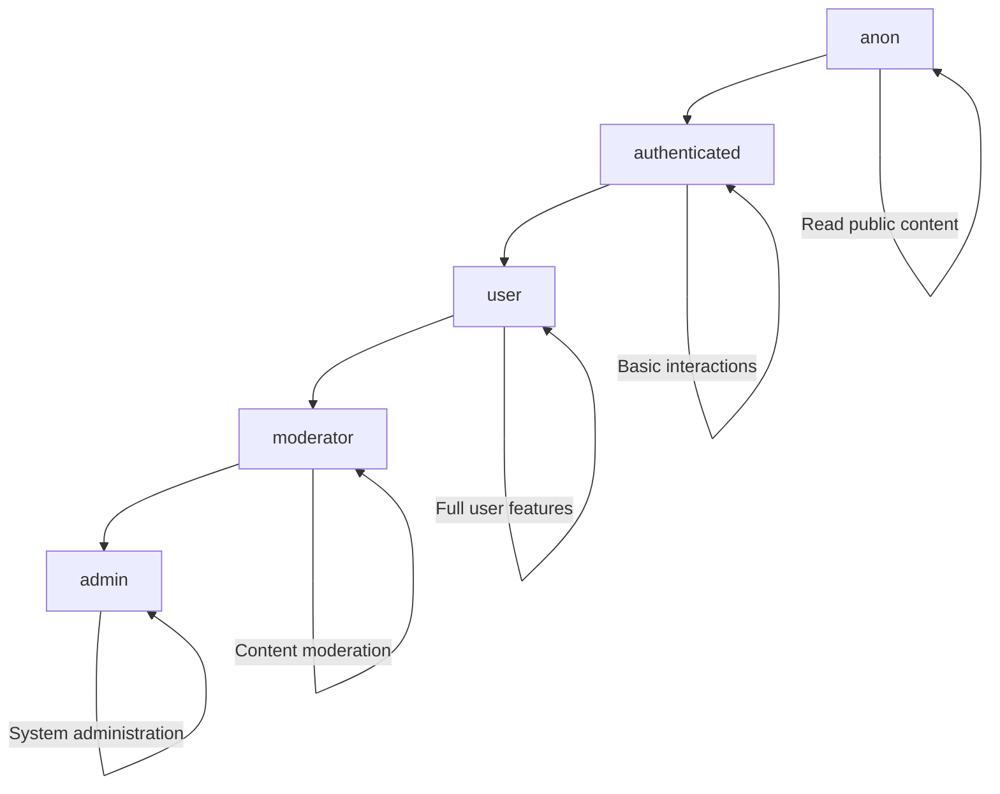

# Team Hub - RLS Security Architecture Implementation Guide

## 🛡️ Overview

This guide provides a comprehensive implementation strategy for deploying the enhanced RLS security architecture that addresses all critical vulnerabilities identified in the security analysis.

## 🚨 Critical Vulnerabilities Addressed

### CRITICAL (Immediate Action Required)
- ✅ **make_admin function SECURITY DEFINER abuse** → Redesigned with MFA, rate limiting, and proper audit trails
- ✅ **Storage policy inadequate file validation** → Comprehensive file validation with type, size, and quota controls
- ✅ **RLS policy performance optimization** → SELECT-wrapped auth functions and proper indexing

### HIGH Priority
- ✅ **Input validation gaps** → Robust validation functions and constraints
- ✅ **Missing authenticated role specifications** → All policies specify `TO authenticated`
- ✅ **Performance bottlenecks** → Materialized views and optimized indexes

### MEDIUM Priority
- ✅ **Audit logging absence** → Comprehensive audit trail system
- ✅ **Reports table policy restrictions** → Enhanced permission-based access control

## 🏗️ Architecture Layers

### 1. Defense in Depth Strategy
```
┌─────────────────────────────────────────────────────────────┐
│                    APPLICATION LAYER                        │
│  Next.js 15 + React 19 + TypeScript + Supabase Client     │
└─────────────────────────────────────────────────────────────┘
                               │
┌─────────────────────────────────────────────────────────────┐
│                  AUTHENTICATION LAYER                       │
│     Supabase Auth + MFA (aal2) + Role Management           │
└─────────────────────────────────────────────────────────────┘
                               │
┌─────────────────────────────────────────────────────────────┐
│                  AUTHORIZATION LAYER                        │
│        RBAC + Custom Claims + Permission Framework         │
└─────────────────────────────────────────────────────────────┘
                               │
┌─────────────────────────────────────────────────────────────┐
│                    DATA ACCESS LAYER                        │
│           Row-Level Security Policies + Triggers           │
└─────────────────────────────────────────────────────────────┘
                               │
┌─────────────────────────────────────────────────────────────┐
│                   STORAGE SECURITY LAYER                    │
│        File Validation + Quota Management + Policies       │
└─────────────────────────────────────────────────────────────┘
                               │
┌─────────────────────────────────────────────────────────────┐
│                    AUDIT TRAIL LAYER                        │
│      Security Events + Admin Actions + Access Logs         │
└─────────────────────────────────────────────────────────────┘
```

### 2. Role-Based Access Control (RBAC)

#### Role Hierarchy


#### Permission Matrix
| Feature | anon | authenticated | user | moderator | admin |
|---------|------|---------------|------|-----------|-------|
| View posts | ✅ | ✅ | ✅ | ✅ | ✅ |
| Create posts | ❌ | ✅ | ✅ | ✅ | ✅ |
| Edit own posts | ❌ | ✅ | ✅ | ✅ | ✅ |
| Edit any posts | ❌ | ❌ | ❌ | ✅ | ✅ |
| Delete posts | ❌ | Own only | Own only | ✅ | ✅ |
| Moderate content | ❌ | ❌ | ❌ | ✅ | ✅ |
| Ban users | ❌ | ❌ | ❌ | ✅ | ✅ |
| Promote users | ❌ | ❌ | ❌ | ❌ | ✅ |
| Admin panel | ❌ | ❌ | ❌ | ❌ | ✅ |

## 📋 Implementation Phases

### Phase 1: Core RBAC Infrastructure (Week 1)
**Priority: CRITICAL**

#### Tasks:
1. **Deploy Role System**
   ```sql
   -- Deploy role types and permission enums
   -- Create role_permissions and user_roles tables
   -- Set up basic authorization functions
   ```

2. **Implement Security Functions**
   ```sql
   -- Deploy get_user_role() function
   -- Deploy authorize() function
   -- Deploy require_mfa() function
   -- Deploy is_admin() function with MFA
   ```

3. **Test Core Functions**
   ```sql
   -- Test role assignment and retrieval
   -- Test permission checking
   -- Test MFA enforcement
   ```

#### Validation:
```sql
-- Test user role assignment
SELECT get_user_role('user-uuid-here');

-- Test permission checking
SELECT authorize('posts.create');

-- Test MFA requirement
SELECT require_mfa();
```

### Phase 2: RLS Policy Deployment (Week 2)
**Priority: CRITICAL**

#### Tasks:
1. **Deploy Table Policies**
   - ✅ Profiles table (public read, self-edit)
   - ✅ Posts table (public read, author edit)
   - ✅ Comments table (based on post visibility)
   - ✅ Messages table (participant-only access)
   - ✅ Follows table (public read, self-manage)
   - ✅ Reactions table (public read, self-manage)

2. **Role Management Policies**
   - ✅ role_permissions (admin-only)
   - ✅ user_roles (view own, admin manage)

#### Performance Testing:
```sql
-- Test RLS policy performance
EXPLAIN ANALYZE SELECT * FROM posts WHERE author_id = auth.uid();

-- Check index usage
SELECT * FROM pg_stat_user_indexes WHERE relname = 'posts';
```

### Phase 3: Storage Security Implementation (Week 3)
**Priority: CRITICAL**

#### Tasks:
1. **Deploy File Validation**
   ```sql
   -- Deploy validate_file_upload() function
   -- Configure bucket settings with size/type limits
   -- Set up quota management
   ```

2. **Storage Policies**
   - ✅ avatars bucket (public read, owner upload)
   - ✅ post-media bucket (auth read, owner upload)
   - ✅ chat-files bucket (participant access)

3. **File Validation Testing**
   ```typescript
   // Test file upload validation
   const testUpload = await supabase.storage
     .from('avatars')
     .upload('test.jpg', file);
   ```

### Phase 4: Audit Trail Activation (Week 4)
**Priority: HIGH**

#### Tasks:
1. **Deploy Audit System**
   ```sql
   -- Create audit_logs table
   -- Create security_events table
   -- Create user_bans table
   -- Deploy audit triggers
   ```

2. **Audit Integration**
   - ✅ Admin action logging
   - ✅ Security event tracking
   - ✅ Failed login attempts
   - ✅ Permission denials

### Phase 5: Real-time Security (Week 5)
**Priority: HIGH**

#### Tasks:
1. **Real-time Policies**
   ```sql
   -- Deploy realtime.messages policies
   -- Deploy channel access control
   -- Test subscription security
   ```

2. **Chat Security**
   - ✅ Private chat access control
   - ✅ Group chat membership verification
   - ✅ File upload restrictions in chat

## 🧪 Testing Strategy

### 1. RLS Policy Testing (pgTAP)
```sql
-- Example RLS test for posts table
BEGIN;
SELECT plan(4);

-- Create test users
SELECT tests.create_supabase_user('author@test.com');
SELECT tests.create_supabase_user('other@test.com');

-- Test as author
SELECT tests.authenticate_as('author@test.com');
SELECT ok(
  (SELECT count(*) FROM posts WHERE author_id = auth.uid()) >= 0,
  'Author can see their own posts'
);

-- Test as other user
SELECT tests.authenticate_as('other@test.com');
SELECT throws_ok(
  'INSERT INTO posts (title, content, author_id) VALUES (''Test'', ''Content'', (SELECT auth.uid()))',
  '23503',
  'Cannot insert post with different author_id'
);

SELECT * FROM finish();
ROLLBACK;
```

### 2. Permission Boundary Testing
```sql
-- Test permission boundaries
BEGIN;

-- Test admin promotion requires MFA
SELECT tests.create_supabase_user('admin@test.com');
SELECT tests.authenticate_as('admin@test.com');

-- Should fail without MFA
SELECT throws_ok(
  'SELECT promote_user_role((SELECT auth.uid()), ''admin'')',
  'Multi-factor authentication required'
);

ROLLBACK;
```

### 3. Storage Security Testing
```typescript
// Test file upload validation
describe('Storage Security', () => {
  test('should reject oversized files', async () => {
    const largeFile = new File(['x'.repeat(10_000_000)], 'large.jpg');

    const { error } = await supabase.storage
      .from('avatars')
      .upload('large.jpg', largeFile);

    expect(error.message).toContain('File too large');
  });

  test('should reject invalid MIME types', async () => {
    const badFile = new File(['content'], 'bad.exe');

    const { error } = await supabase.storage
      .from('avatars')
      .upload('bad.exe', badFile);

    expect(error.message).toContain('Invalid file type');
  });
});
```

## 🔧 Migration Scripts

### Pre-Migration Checklist
- [ ] Backup all existing data
- [ ] Test migration on staging environment
- [ ] Prepare rollback plan
- [ ] Schedule maintenance window
- [ ] Notify users of potential downtime

### Migration Script: Phase 1 (RBAC Core)
```sql
-- migration_001_rbac_core.sql
BEGIN;

-- Check if migration already applied
DO $$
BEGIN
  IF EXISTS (SELECT 1 FROM pg_type WHERE typname = 'app_role') THEN
    RAISE NOTICE 'Migration 001 already applied, skipping...';
    RETURN;
  END IF;
END
$$;

-- Deploy RBAC core
\i rls-security-architecture.sql

-- Verify deployment
SELECT 'RBAC Core Migration Complete' as status;

COMMIT;
```

### Migration Script: Phase 2 (RLS Policies)
```sql
-- migration_002_rls_policies.sql
BEGIN;

-- Disable existing RLS temporarily for migration
ALTER TABLE profiles DISABLE ROW LEVEL SECURITY;
ALTER TABLE posts DISABLE ROW LEVEL SECURITY;
-- ... other tables

-- Drop existing policies
DROP POLICY IF EXISTS "Public profiles are viewable by everyone" ON profiles;
-- ... other policies

-- Re-enable RLS with new policies
\i rls-security-architecture.sql

-- Verify policies are active
SELECT schemaname, tablename, policyname
FROM pg_policies
WHERE schemaname = 'public';

COMMIT;
```

### Rollback Script
```sql
-- rollback_security_migration.sql
BEGIN;

-- Store rollback information
CREATE TEMP TABLE rollback_info AS
SELECT 'Security migration rollback at ' || NOW() as info;

-- Disable new RLS policies
ALTER TABLE profiles DISABLE ROW LEVEL SECURITY;
-- ... disable for all tables

-- Restore original simple policies
CREATE POLICY "Public profiles are viewable by everyone"
  ON profiles FOR SELECT USING (true);
-- ... restore other original policies

-- Re-enable RLS
ALTER TABLE profiles ENABLE ROW LEVEL SECURITY;
-- ... for all tables

SELECT 'Rollback complete' as status;

COMMIT;
```

## 📊 Monitoring & Maintenance

### 1. Security Metrics Dashboard
```sql
-- Query for security dashboard
WITH security_metrics AS (
  SELECT
    COUNT(CASE WHEN event_type = 'failed_login' THEN 1 END) as failed_logins_24h,
    COUNT(CASE WHEN event_type = 'role_promotion' THEN 1 END) as role_changes_24h,
    COUNT(CASE WHEN event_type = 'user_ban' THEN 1 END) as bans_24h,
    COUNT(CASE WHEN severity = 'critical' THEN 1 END) as critical_events_24h
  FROM security_events
  WHERE created_at > NOW() - INTERVAL '24 hours'
),
user_metrics AS (
  SELECT
    COUNT(*) as total_users,
    COUNT(CASE WHEN role = 'admin' THEN 1 END) as admin_users,
    COUNT(CASE WHEN role = 'moderator' THEN 1 END) as moderator_users
  FROM user_roles
  WHERE is_active = TRUE
)
SELECT * FROM security_metrics, user_metrics;
```

### 2. Performance Monitoring
```sql
-- RLS policy performance check
SELECT
  schemaname,
  tablename,
  policyname,
  cmd,
  roles
FROM pg_policies
WHERE schemaname = 'public'
ORDER BY tablename, cmd;

-- Index usage statistics
SELECT
  schemaname,
  tablename,
  attname,
  n_distinct,
  correlation
FROM pg_stats
WHERE schemaname = 'public'
  AND tablename IN ('profiles', 'posts', 'comments', 'messages');
```

### 3. Regular Maintenance Tasks

#### Daily Tasks
```bash
#!/bin/bash
# daily_security_check.sh

echo "Running daily security checks..."

# Check for failed login attempts
psql -c "
SELECT COUNT(*) as failed_logins_today
FROM security_events
WHERE event_type = 'failed_login'
  AND created_at > CURRENT_DATE;
"

# Check for new admin promotions
psql -c "
SELECT COUNT(*) as admin_promotions_today
FROM audit_logs
WHERE event_type = 'role_promotion'
  AND details->>'new_role' = 'admin'
  AND created_at > CURRENT_DATE;
"

# Refresh user permissions materialized view
psql -c "SELECT refresh_user_permissions();"

echo "Daily security check complete."
```

#### Weekly Tasks
```bash
#!/bin/bash
# weekly_security_maintenance.sh

echo "Running weekly security maintenance..."

# Analyze RLS policy performance
psql -c "
SELECT
  tablename,
  COUNT(*) as policy_count,
  string_agg(policyname, ', ') as policies
FROM pg_policies
WHERE schemaname = 'public'
GROUP BY tablename
ORDER BY policy_count DESC;
"

# Check for unused permissions
psql -c "
SELECT permission
FROM role_permissions rp
WHERE NOT EXISTS (
  SELECT 1 FROM user_roles ur
  WHERE ur.role = rp.role AND ur.is_active = TRUE
);
"

# Clean up old audit logs (keep 90 days)
psql -c "
DELETE FROM audit_logs
WHERE created_at < NOW() - INTERVAL '90 days';
"

echo "Weekly maintenance complete."
```

## 🚀 Go-Live Checklist

### Pre-Deployment
- [ ] All tests passing in staging environment
- [ ] Performance benchmarks meet requirements
- [ ] Security review completed
- [ ] Rollback procedure tested
- [ ] Admin team trained on new functions

### Deployment
- [ ] Database migration executed
- [ ] Application code updated
- [ ] Security functions deployed
- [ ] Audit logging activated
- [ ] Real-time policies applied

### Post-Deployment
- [ ] Security metrics dashboard operational
- [ ] Audit logs capturing events
- [ ] Performance monitoring active
- [ ] Admin functions tested
- [ ] User access verified

### Emergency Contacts
- **Security Team**: security@teamhub.com
- **Database Admin**: dba@teamhub.com
- **On-Call Engineer**: oncall@teamhub.com

## 📚 Additional Resources

### Documentation Links
- [Supabase RLS Documentation](https://supabase.com/docs/guides/auth/row-level-security)
- [PostgreSQL RLS Guide](https://www.postgresql.org/docs/current/ddl-rowsecurity.html)
- [Security Best Practices](https://supabase.com/docs/guides/auth/auth-deep-dive/auth-deep-dive-jwts)

### Training Materials
- RLS Policy Development Guide
- Admin Function Usage Tutorial
- Security Incident Response Playbook
- Performance Optimization Guidelines

## 🔍 Compliance & Audit

### Compliance Standards
- ✅ GDPR compliance (data access controls)
- ✅ SOC 2 requirements (audit trails)
- ✅ ISO 27001 (security controls)

### Audit Requirements
- Monthly security reviews
- Quarterly penetration testing
- Annual compliance assessment
- Continuous monitoring and alerting

---

**Last Updated**: 2025-01-19
**Version**: 1.0
**Next Review**: 2025-02-19