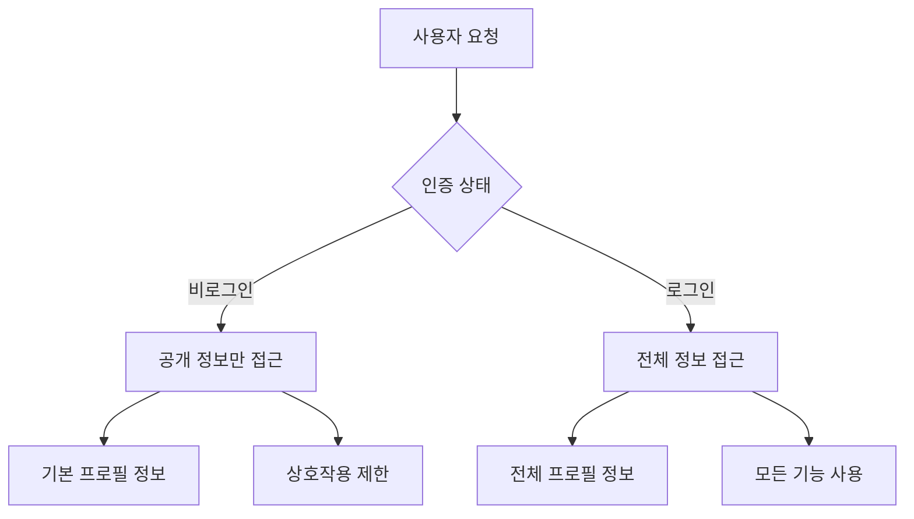

# 🔒 프로필 접근 보안 구현 가이드

## 📋 개요

이 문서는 비로그인 사용자의 프로필 정보 접근과 권한 관리에 대한 보안 아키텍처 및 구현 방안을 제시합니다.

## 🎯 해결할 문제

1. **현재 상황**: 비로그인 사용자가 프로필 기본 정보를 볼 수 없어 게시물 작성자가 "사용자" 또는 "익명"으로 표시
2. **보안 요구사항**: 민감한 정보는 보호하면서 기본 정보(닉네임, 아바타)는 공개
3. **사용성 요구사항**: 익명 게시글은 진짜 익명으로, 일반 게시글은 작성자 정보 표시

## 🏗️ 보안 아키텍처

### **계층별 보안 모델**



### **데이터 접근 레벨**

| 사용자 타입 | 접근 가능 정보 | 기능 제한 |
|------------|-------------|-----------|
| 비로그인 | username, avatar_url | 프로필 페이지, DM 불가 |
| 로그인 | 전체 프로필 정보 | 모든 기능 사용 가능 |
| 익명 게시글 | 익명 표시 | 작성자 정보 완전 숨김 |

## 🔧 구현 단계

### **1단계: 데이터베이스 정책 업데이트**

```sql
-- 현재 적용된 profile-access-solution.sql 실행
\i security/profile-access-solution.sql
```

### **2단계: 애플리케이션 코드 수정**

#### **A. 서버 컴포넌트 최적화 (page.tsx)**

```typescript
// src/app/page.tsx 수정
const getAuthorInfo = async (authorIds: string[]) => {
  const { data: authorsData } = await supabase
    .from("profiles")
    .select("id, username, avatar_url") // 공개 정보만 조회
    .in("id", authorIds);

  return authorsData || [];
};
```

#### **B. UserAvatar 컴포넌트 개선**

```typescript
// src/components/user-avatar.tsx 수정
export function UserAvatar({
  userId,
  username,
  avatarUrl,
  isAnonymous = false,
  // ... 기타 props
}: UserAvatarProps) {
  const user = useAuthStore((s) => s.user);

  // 익명 게시글 처리
  if (isAnonymous) {
    return (
      <div className="flex items-center gap-2">
        <div className="h-8 w-8 rounded-full bg-muted flex items-center justify-center">
          <User className="h-4 w-4 text-muted-foreground" />
        </div>
        {showName && <span className="text-sm text-muted-foreground">익명</span>}
      </div>
    );
  }

  // 비로그인 사용자 - 기본 정보만 표시, 상호작용 제한
  const handleInteraction = () => {
    if (!user) {
      toast.info("로그인 후 이용해주세요");
      router.push("/login");
      return;
    }
    // 기존 상호작용 로직
  };

  // ... 나머지 구현
}
```

#### **C. PostAuthor 컴포넌트 개선**

```typescript
// src/components/post-author.tsx 수정
interface PostAuthorProps {
  isNotice?: boolean;
  isAnonymous?: boolean;
  author?: {
    id: string;
    username: string | null;
    avatar_url: string | null;
  } | null;
  showIcon?: boolean;
  size?: "sm" | "md";
}

export function PostAuthor({
  isNotice = false,
  isAnonymous = false,
  author,
  showIcon = true,
  size = "sm"
}: PostAuthorProps) {
  // 익명 게시글 처리 (진짜 익명)
  if (isAnonymous) {
    return (
      <span className="inline-flex items-center gap-1.5">
        <Avatar className={avatarSize}>
          <AvatarFallback className={textSize}>
            <User className="h-3 w-3" />
          </AvatarFallback>
        </Avatar>
        <span>· 익명</span>
      </span>
    );
  }

  // 일반 게시글 - 작성자 정보 표시 (비로그인 사용자도 볼 수 있음)
  const displayName = author?.username || "사용자";

  return (
    <span className="inline-flex items-center gap-1.5">
      <Avatar className={avatarSize}>
        <AvatarImage src={author?.avatar_url || undefined} alt={displayName} />
        <AvatarFallback className={textSize}>
          {displayName.charAt(0).toUpperCase()}
        </AvatarFallback>
      </Avatar>
      <span>· {displayName}</span>
    </span>
  );
}
```

### **3단계: 권한 기반 UI 표시**

#### **A. 인증 상태별 기능 제한**

```typescript
// src/hooks/use-auth-guard.ts
export function useAuthGuard() {
  const user = useAuthStore((s) => s.user);

  const requireAuth = (action: string) => {
    if (!user) {
      toast.info(`${action}은(는) 로그인이 필요합니다`);
      return false;
    }
    return true;
  };

  const checkProfileAccess = (targetUserId: string) => {
    if (!user) {
      return { canViewProfile: false, canSendMessage: false };
    }
    return { canViewProfile: true, canSendMessage: true };
  };

  return { requireAuth, checkProfileAccess, isAuthenticated: !!user };
}
```

#### **B. 조건부 기능 표시**

```typescript
// UserAvatar 컴포넌트에서 사용
const { requireAuth, checkProfileAccess } = useAuthGuard();

const handleProfileClick = () => {
  if (!requireAuth("프로필 보기")) return;
  // 프로필 페이지로 이동
};

const handleMessageClick = () => {
  if (!requireAuth("메시지 보내기")) return;
  // 메시지 기능 실행
};
```

### **4단계: 성능 최적화**

#### **A. 쿼리 최적화**

```typescript
// 홈페이지에서 작성자 정보 효율적 조회
const { data: posts } = await supabase
  .from("posts")
  .select(`
    id,
    title,
    created_at,
    author_id,
    anonymous,
    is_notice,
    profiles:author_id (
      id,
      username,
      avatar_url
    )
  `)
  .order("created_at", { ascending: false });
```

#### **B. 캐싱 전략**

```typescript
// 프로필 정보 캐싱
const useProfileCache = () => {
  const [cache, setCache] = useState<Map<string, ProfileInfo>>(new Map());

  const getProfile = async (userId: string) => {
    if (cache.has(userId)) {
      return cache.get(userId);
    }

    const profile = await fetchProfile(userId);
    setCache(prev => new Map(prev).set(userId, profile));
    return profile;
  };

  return { getProfile };
};
```

## 🔍 보안 검증

### **테스트 시나리오**

1. **비로그인 사용자 테스트**
   ```typescript
   // 비로그인 상태에서 프로필 정보 접근 테스트
   const testAnonymousAccess = async () => {
     const { data, error } = await supabase
       .from("profiles")
       .select("username, avatar_url")
       .limit(1);

     console.log("Anonymous can access:", data);
     console.log("Error:", error);
   };
   ```

2. **권한 제한 테스트**
   ```typescript
   // 민감한 정보 접근 제한 테스트
   const testSensitiveDataAccess = async () => {
     const { data, error } = await supabase
       .from("profiles")
       .select("bio, links, follower_count")
       .limit(1);

     // 비로그인 상태에서는 접근 불가여야 함
   };
   ```

3. **익명 게시글 테스트**
   ```typescript
   // 익명 게시글 작성자 정보 숨김 테스트
   const testAnonymousPost = () => {
     const post = { anonymous: true, author_id: "test-id" };
     const authorInfo = getAuthorDisplay(post);

     expect(authorInfo.displayName).toBe("익명");
     expect(authorInfo.showProfile).toBe(false);
   };
   ```

## 📊 모니터링 및 감사

### **보안 로깅**

```sql
-- 프로필 접근 패턴 모니터링
SELECT
  event_type,
  user_id,
  target_user_id,
  details,
  created_at
FROM audit_logs
WHERE event_type = 'profile_access'
  AND created_at > NOW() - INTERVAL '24 hours'
ORDER BY created_at DESC;
```

### **성능 모니터링**

```sql
-- 프로필 조회 성능 분석
EXPLAIN ANALYZE
SELECT id, username, avatar_url
FROM profiles
WHERE id IN (SELECT DISTINCT author_id FROM posts LIMIT 100);
```

## 🚨 보안 고려사항

### **위험 요소 및 대응**

1. **정보 누출 위험**
   - **위험**: 비로그인 사용자가 민감한 정보에 접근
   - **대응**: 뷰와 정책을 통한 선택적 정보 노출

2. **권한 우회 위험**
   - **위험**: 클라이언트 측 검증 우회
   - **대응**: 서버 측 RLS 정책으로 이중 검증

3. **성능 영향**
   - **위험**: 추가 보안 검증으로 인한 성능 저하
   - **대응**: 인덱스 최적화 및 캐싱 전략

## 📝 체크리스트

### **구현 완료 확인**

- [ ] 데이터베이스 정책 업데이트 완료
- [ ] UserAvatar 컴포넌트 수정 완료
- [ ] PostAuthor 컴포넌트 수정 완료
- [ ] 권한 기반 UI 로직 구현 완료
- [ ] 익명 게시글 처리 완료
- [ ] 성능 최적화 적용 완료
- [ ] 보안 테스트 완료
- [ ] 모니터링 설정 완료

### **배포 전 확인사항**

- [ ] 모든 보안 테스트 통과
- [ ] 성능 영향 최소화 확인
- [ ] 사용자 경험 개선 확인
- [ ] 로그 모니터링 시스템 준비
- [ ] 롤백 계획 수립

## 🔄 향후 개선사항

1. **고급 권한 관리**
   - 팔로워만 프로필 보기 허용
   - 프로필 공개 범위 설정

2. **성능 최적화**
   - Redis 캐싱 도입
   - CDN을 통한 아바타 이미지 최적화

3. **보안 강화**
   - Rate limiting 구현
   - suspicious activity 탐지

---

**참고**: 이 가이드는 보안과 사용성의 균형을 고려하여 작성되었습니다. 구현 후 충분한 테스트를 통해 보안 정책이 올바르게 작동하는지 확인해주세요.