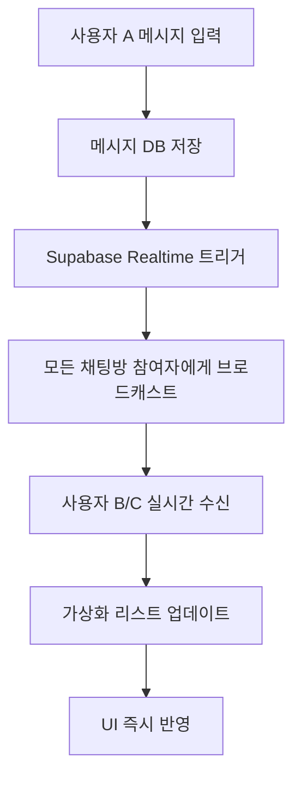

# 실시간 채팅 구현 계획서

**작성일**: 2025-01-15
**프로젝트**: AI 지식 교류 허브 - 채팅 시스템
**기술 스택**: Next.js 15, React 19, Supabase Realtime, TypeScript
**현재 상태**: 가상화 시스템 완료, 실시간 기능 미구현

---

## 📋 목차

- [1. 현재 상황 분석](#1-현재-상황-분석)
- [2. 실시간 채팅 아키텍처 설계](#2-실시간-채팅-아키텍처-설계)
- [3. Supabase Realtime 통합 전략](#3-supabase-realtime-통합-전략)
- [4. 구현 로드맵](#4-구현-로드맵)
- [5. 성능 최적화 전략](#5-성능-최적화-전략)
- [6. 호환성 및 안정성 고려사항](#6-호환성-및-안정성-고려사항)
- [7. 테스트 및 모니터링](#7-테스트-및-모니터링)

---

## 1. 현재 상황 분석

### ✅ 완료된 시스템
- **가상화 메시지 리스트**: TanStack Virtual 기반으로 대용량 메시지 처리 완료
- **채팅 UI/UX**: 카카오톡 스타일의 완성된 인터페이스
- **메시지 CRUD**: 메시지 전송/수신/표시 기본 기능 완료
- **채팅방 관리**: 다중 사용자 채팅방, 개인 채팅 지원

### ❌ 현재 문제점
```typescript
// 현재 구조의 한계
// use-chat.ts에서 폴링 방식으로 메시지 로드
const loadMessages = async (roomId: string) => {
  // API 호출로만 메시지 가져옴 - 실시간 불가
  const response = await fetch(`/api/chat/messages?room_id=${roomId}`);
  // 상대방이 보낸 메시지를 즉시 볼 수 없음
};
```

### 🎯 구현 목표
1. **즉시성**: 메시지 전송 즉시 모든 참여자에게 표시
2. **타이핑 표시**: 상대방이 입력 중일 때 실시간 표시
3. **온라인 상태**: 사용자 접속 상태 실시간 업데이트
4. **읽음 상태**: 메시지 읽음 처리 실시간 동기화
5. **가상화 호환**: 기존 가상화 시스템과 완벽 통합

---

## 2. 실시간 채팅 아키텍처 설계

### 🏗️ Supabase Realtime 아키텍처

```typescript
// 전체 실시간 시스템 구조
interface RealtimeChatArchitecture {
  // 1. 메시지 실시간 동기화
  messageSync: {
    channel: `room:${roomId}:messages`,
    events: ['INSERT', 'UPDATE', 'DELETE'],
    table: 'messages'
  };

  // 2. 타이핑 상태 (Broadcast)
  typingIndicator: {
    channel: `room:${roomId}:typing`,
    event: 'typing_status',
    payload: { user_id: string, is_typing: boolean }
  };

  // 3. 사용자 온라인 상태 (Presence)
  userPresence: {
    channel: `room:${roomId}:presence`,
    presence: { user_id: string, last_seen: timestamp }
  };

  // 4. 읽음 상태 동기화
  readStatus: {
    channel: `room:${roomId}:read_status`,
    event: 'message_read',
    payload: { message_id: string, user_id: string }
  };
}
```

### 🔄 데이터 플로우 설계



---

## 3. Supabase Realtime 통합 전략

### 📡 채널 설계 패턴

```typescript
// 1. 메시지 실시간 동기화 (Database Changes)
const messagesChannel = supabase
  .channel(`room:${roomId}:messages`)
  .on('postgres_changes', {
    event: '*',
    schema: 'public',
    table: 'messages',
    filter: `room_id=eq.${roomId}`
  }, (payload) => {
    handleMessageChange(payload);
  });

// 2. 타이핑 표시 (Broadcast)
const typingChannel = supabase
  .channel(`room:${roomId}:typing`)
  .on('broadcast', {
    event: 'typing_status'
  }, (payload) => {
    handleTypingStatus(payload);
  });

// 3. 사용자 온라인 상태 (Presence)
const presenceChannel = supabase
  .channel(`room:${roomId}:presence`)
  .on('presence', { event: 'sync' }, () => {
    handlePresenceSync();
  });
```

### 🔐 Row Level Security (RLS) 정책

```sql
-- 메시지 실시간 접근 권한
CREATE POLICY "room_members_can_receive_realtime_messages"
ON "realtime"."messages"
FOR SELECT
TO authenticated
USING (
  topic LIKE 'room:%:messages' AND
  EXISTS (
    SELECT 1 FROM chat_room_participants
    WHERE user_id = auth.uid()
    AND room_id = SPLIT_PART(topic, ':', 2)::uuid
  )
);

-- 타이핑/Presence 브로드캐스트 권한
CREATE POLICY "room_members_can_broadcast_typing"
ON "realtime"."messages"
FOR INSERT
TO authenticated
WITH CHECK (
  topic LIKE 'room:%:typing' AND
  EXISTS (
    SELECT 1 FROM chat_room_participants
    WHERE user_id = auth.uid()
    AND room_id = SPLIT_PART(topic, ':', 2)::uuid
  )
);
```

---

## 4. 구현 로드맵

### 🎯 Phase 1: 기본 실시간 메시지 (1주)

#### **Step 1.1: Realtime Hook 구현**
```typescript
// hooks/use-realtime-chat.ts
export function useRealtimeChat(roomId: string | null) {
  const [realtimeChannel, setRealtimeChannel] = useState<RealtimeChannel | null>(null);
  const [isConnected, setIsConnected] = useState(false);

  // 메시지 실시간 구독
  const subscribeToMessages = useCallback((roomId: string) => {
    const channel = supabase
      .channel(`room:${roomId}:messages`)
      .on('postgres_changes', {
        event: 'INSERT',
        schema: 'public',
        table: 'messages',
        filter: `room_id=eq.${roomId}`
      }, (payload) => {
        // 새 메시지를 가상화 리스트에 추가
        onNewMessage(payload.new as ChatMessage);
      })
      .subscribe((status) => {
        setIsConnected(status === 'SUBSCRIBED');
      });

    setRealtimeChannel(channel);
    return channel;
  }, []);

  return { subscribeToMessages, isConnected };
}
```

#### **Step 1.2: 기존 Hook 확장**
```typescript
// hooks/use-chat.ts 확장
export function useChatHook() {
  // 기존 상태들...
  const { subscribeToMessages, isConnected } = useRealtimeChat(currentRoom?.id);

  // 실시간 메시지 핸들러
  const handleNewRealtimeMessage = useCallback((message: ChatMessage) => {
    // 중복 방지: 이미 있는 메시지인지 확인
    setMessages(prev => {
      const exists = prev.some(m => m.id === message.id);
      if (exists) return prev;

      // 가상화 리스트에 새 메시지 추가
      return [...prev, message];
    });

    // 채팅방 리스트의 최근 메시지도 업데이트
    setRooms(prev => prev.map(room =>
      room.id === message.room_id
        ? { ...room, last_message: message }
        : room
    ));
  }, []);

  // 채팅방 선택 시 실시간 구독 시작
  const selectRoom = useCallback(async (room: ChatRoomWithParticipants) => {
    setCurrentRoom(room);
    await loadMessages(room.id);
    subscribeToMessages(room.id); // 실시간 구독 시작
  }, [loadMessages, subscribeToMessages]);

  return {
    // 기존 반환값들...
    isRealtimeConnected: isConnected
  };
}
```

#### **Step 1.3: 가상화 시스템 통합**
```typescript
// components/chat/virtualized/VirtualizedMessageList.tsx 확장
export const VirtualizedMessageList = forwardRef<VirtualizedMessageListRef, Props>(
  ({ messages, onNewMessage, ...props }, ref) => {
    // 새 메시지 수신 시 자동 스크롤
    useEffect(() => {
      if (messages.length > 0) {
        const isAtBottom = virtualizer.scrollOffset >=
          virtualizer.getTotalSize() - containerHeight - 100;

        if (isAtBottom) {
          // 사용자가 하단에 있으면 자동 스크롤
          scrollToBottom("smooth");
        }
      }
    }, [messages.length]);

    return (
      // 기존 가상화 렌더링...
    );
  }
);
```

### 🎯 Phase 2: 타이핑 표시 구현 (3일)

#### **Step 2.1: 타이핑 상태 관리**
```typescript
// hooks/use-typing-indicator.ts
export function useTypingIndicator(roomId: string | null) {
  const [typingUsers, setTypingUsers] = useState<Set<string>>(new Set());
  const [typingChannel, setTypingChannel] = useState<RealtimeChannel | null>(null);
  const { user } = useAuthStore();

  const startTyping = useCallback(() => {
    if (!typingChannel || !user) return;

    typingChannel.send({
      type: 'broadcast',
      event: 'typing_status',
      payload: { user_id: user.id, is_typing: true }
    });
  }, [typingChannel, user]);

  const stopTyping = useCallback(() => {
    if (!typingChannel || !user) return;

    typingChannel.send({
      type: 'broadcast',
      event: 'typing_status',
      payload: { user_id: user.id, is_typing: false }
    });
  }, [typingChannel, user]);

  return { typingUsers, startTyping, stopTyping };
}
```

#### **Step 2.2: 입력 컴포넌트 연동**
```typescript
// components/chat/TypingInput.tsx
export function TypingInput({ roomId, onSendMessage }: Props) {
  const { startTyping, stopTyping } = useTypingIndicator(roomId);
  const [message, setMessage] = useState("");
  const typingTimeoutRef = useRef<NodeJS.Timeout>();

  const handleInputChange = useCallback((e: ChangeEvent<HTMLTextAreaElement>) => {
    const value = e.target.value;
    setMessage(value);

    if (value.trim()) {
      // 타이핑 시작
      startTyping();

      // 2초 후 타이핑 중지
      clearTimeout(typingTimeoutRef.current);
      typingTimeoutRef.current = setTimeout(() => {
        stopTyping();
      }, 2000);
    } else {
      stopTyping();
    }
  }, [startTyping, stopTyping]);

  return (
    <Textarea
      value={message}
      onChange={handleInputChange}
      onBlur={stopTyping}
      // 기존 props...
    />
  );
}
```

#### **Step 2.3: 타이핑 표시 UI**
```typescript
// components/chat/TypingIndicator.tsx
export function TypingIndicator({ typingUsers, participants }: Props) {
  if (typingUsers.size === 0) return null;

  const typingUserNames = Array.from(typingUsers)
    .map(userId => participants.find(p => p.id === userId)?.username)
    .filter(Boolean);

  return (
    <div className="px-4 py-2 text-sm text-muted-foreground">
      <div className="flex items-center space-x-2">
        <div className="typing-dots">
          <span></span><span></span><span></span>
        </div>
        <span>
          {typingUserNames.length === 1
            ? `${typingUserNames[0]}님이 입력 중...`
            : `${typingUserNames.length}명이 입력 중...`
          }
        </span>
      </div>
    </div>
  );
}
```

### 🎯 Phase 3: 사용자 온라인 상태 (2일)

#### **Step 3.1: Presence 훅**
```typescript
// hooks/use-user-presence.ts
export function useUserPresence(roomId: string | null) {
  const [onlineUsers, setOnlineUsers] = useState<Set<string>>(new Set());
  const [presenceChannel, setPresenceChannel] = useState<RealtimeChannel | null>(null);
  const { user } = useAuthStore();

  useEffect(() => {
    if (!roomId || !user) return;

    const channel = supabase
      .channel(`room:${roomId}:presence`)
      .on('presence', { event: 'sync' }, () => {
        const presenceState = channel.presenceState();
        const online = Object.keys(presenceState);
        setOnlineUsers(new Set(online));
      })
      .on('presence', { event: 'join' }, ({ key, newPresences }) => {
        setOnlineUsers(prev => new Set([...prev, key]));
      })
      .on('presence', { event: 'leave' }, ({ key, leftPresences }) => {
        setOnlineUsers(prev => {
          const next = new Set(prev);
          next.delete(key);
          return next;
        });
      })
      .subscribe(async (status) => {
        if (status === 'SUBSCRIBED') {
          await channel.track({
            user_id: user.id,
            username: user.username,
            last_seen: new Date().toISOString()
          });
        }
      });

    setPresenceChannel(channel);

    return () => {
      supabase.removeChannel(channel);
    };
  }, [roomId, user]);

  return { onlineUsers };
}
```

### 🎯 Phase 4: 읽음 상태 동기화 (3일)

#### **Step 4.1: 읽음 상태 테이블 설계**
```sql
-- 읽음 상태 추적 테이블
CREATE TABLE message_read_status (
  id UUID PRIMARY KEY DEFAULT gen_random_uuid(),
  message_id UUID REFERENCES messages(id) ON DELETE CASCADE,
  user_id UUID REFERENCES profiles(id) ON DELETE CASCADE,
  read_at TIMESTAMPTZ DEFAULT NOW(),
  created_at TIMESTAMPTZ DEFAULT NOW(),
  UNIQUE(message_id, user_id)
);

-- 인덱스
CREATE INDEX idx_message_read_status_message_id ON message_read_status(message_id);
CREATE INDEX idx_message_read_status_user_id ON message_read_status(user_id);
```

#### **Step 4.2: 읽음 상태 실시간 동기화**
```typescript
// hooks/use-read-status.ts
export function useReadStatus(roomId: string | null) {
  const [readStatus, setReadStatus] = useState<Map<string, Set<string>>>(new Map());
  const { user } = useAuthStore();

  const markAsRead = useCallback(async (messageId: string) => {
    if (!user || !roomId) return;

    try {
      // DB에 읽음 상태 저장
      await supabase
        .from('message_read_status')
        .upsert({ message_id: messageId, user_id: user.id });

      // 실시간으로 다른 사용자에게 알림
      const channel = supabase.channel(`room:${roomId}:read_status`);
      await channel.send({
        type: 'broadcast',
        event: 'message_read',
        payload: { message_id: messageId, user_id: user.id }
      });
    } catch (error) {
      console.error('Failed to mark message as read:', error);
    }
  }, [user, roomId]);

  return { readStatus, markAsRead };
}
```

---

## 5. 성능 최적화 전략

### ⚡ 연결 관리 최적화

```typescript
// utils/realtime-manager.ts
class RealtimeManager {
  private channels: Map<string, RealtimeChannel> = new Map();
  private connectionState: 'connecting' | 'connected' | 'disconnected' = 'disconnected';

  // 채널 풀링으로 불필요한 연결 방지
  getOrCreateChannel(channelName: string, config: any) {
    if (this.channels.has(channelName)) {
      return this.channels.get(channelName)!;
    }

    const channel = supabase.channel(channelName, config);
    this.channels.set(channelName, channel);
    return channel;
  }

  // 방 변경 시 이전 채널 정리
  cleanupRoomChannels(roomId: string) {
    const patterns = [`room:${roomId}:messages`, `room:${roomId}:typing`, `room:${roomId}:presence`];
    patterns.forEach(pattern => {
      const channel = this.channels.get(pattern);
      if (channel) {
        supabase.removeChannel(channel);
        this.channels.delete(pattern);
      }
    });
  }
}

export const realtimeManager = new RealtimeManager();
```

### 📊 메시지 중복 방지

```typescript
// utils/message-deduplication.ts
class MessageDeduplicationManager {
  private processedMessages = new Set<string>();
  private messageQueue: ChatMessage[] = [];

  addMessage(message: ChatMessage): boolean {
    // 중복 메시지 체크
    if (this.processedMessages.has(message.id)) {
      return false; // 이미 처리된 메시지
    }

    this.processedMessages.add(message.id);

    // 메모리 관리: 1000개 제한
    if (this.processedMessages.size > 1000) {
      const oldest = Array.from(this.processedMessages)[0];
      this.processedMessages.delete(oldest);
    }

    return true; // 새 메시지
  }
}
```

### 🔄 백그라운드 동기화

```typescript
// hooks/use-background-sync.ts
export function useBackgroundSync(roomId: string | null) {
  const { user } = useAuthStore();
  const [isVisible, setIsVisible] = useState(true);

  // 페이지 가시성 API 활용
  useEffect(() => {
    const handleVisibilityChange = () => {
      setIsVisible(!document.hidden);
    };

    document.addEventListener('visibilitychange', handleVisibilityChange);
    return () => document.removeEventListener('visibilitychange', handleVisibilityChange);
  }, []);

  // 백그라운드에서 돌아왔을 때 동기화
  useEffect(() => {
    if (isVisible && roomId) {
      // 놓친 메시지가 있는지 확인하고 동기화
      syncMissedMessages(roomId);
    }
  }, [isVisible, roomId]);
}
```

---

## 6. 호환성 및 안정성 고려사항

### 🔒 에러 처리 및 재연결

```typescript
// hooks/use-resilient-realtime.ts
export function useResilientRealtime(roomId: string | null) {
  const [retryCount, setRetryCount] = useState(0);
  const [connectionState, setConnectionState] = useState<'connecting' | 'connected' | 'error'>('connecting');

  const connectWithRetry = useCallback(async (roomId: string) => {
    try {
      const channel = await connectToRoom(roomId);
      setConnectionState('connected');
      setRetryCount(0);
      return channel;
    } catch (error) {
      setConnectionState('error');

      // 지수 백오프로 재연결
      if (retryCount < 5) {
        const delay = Math.min(1000 * Math.pow(2, retryCount), 30000);
        setTimeout(() => {
          setRetryCount(prev => prev + 1);
          connectWithRetry(roomId);
        }, delay);
      }
    }
  }, [retryCount]);

  return { connectionState, connectWithRetry };
}
```

### 🌐 브라우저 호환성

```typescript
// utils/feature-detection.ts
export const realtimeSupport = {
  hasWebSocket: typeof WebSocket !== 'undefined',
  hasVisibilityAPI: typeof document.visibilityState !== 'undefined',
  hasNotificationAPI: 'Notification' in window,

  // 폴백 모드 (WebSocket 미지원 시)
  getFallbackMode(): 'polling' | 'sse' | 'none' {
    if (!this.hasWebSocket) {
      return 'polling'; // 폴링으로 폴백
    }
    return 'none';
  }
};

// 폴백 모드에서 폴링 구현
export function useFallbackPolling(roomId: string | null, enabled: boolean) {
  useEffect(() => {
    if (!enabled || !roomId) return;

    const interval = setInterval(async () => {
      // API로 새 메시지 확인
      await checkForNewMessages(roomId);
    }, 3000); // 3초마다 폴링

    return () => clearInterval(interval);
  }, [roomId, enabled]);
}
```

### 📱 모바일 최적화

```typescript
// hooks/use-mobile-optimizations.ts
export function useMobileOptimizations() {
  const [isBackground, setIsBackground] = useState(false);

  useEffect(() => {
    // 모바일에서 백그라운드/포그라운드 감지
    const handleAppStateChange = () => {
      if (document.hidden) {
        setIsBackground(true);
        // 백그라운드에서는 연결 최소화
        realtimeManager.pauseNonEssentialChannels();
      } else {
        setIsBackground(false);
        // 포그라운드로 돌아오면 재연결
        realtimeManager.resumeAllChannels();
      }
    };

    document.addEventListener('visibilitychange', handleAppStateChange);
    return () => document.removeEventListener('visibilitychange', handleAppStateChange);
  }, []);

  return { isBackground };
}
```

---

## 7. 테스트 및 모니터링

### 🧪 테스트 전략

```typescript
// __tests__/realtime-chat.test.tsx
describe('Realtime Chat Integration', () => {
  test('should receive messages in real-time', async () => {
    const { result } = renderHook(() => useRealtimeChat('room-123'));

    // 메시지 전송 시뮬레이션
    const testMessage = { id: 'msg-1', content: 'Hello', room_id: 'room-123' };

    // 실시간 수신 확인
    act(() => {
      result.current.simulateIncomingMessage(testMessage);
    });

    expect(result.current.messages).toContain(testMessage);
  });

  test('should handle connection failures gracefully', async () => {
    const { result } = renderHook(() => useResilientRealtime('room-123'));

    // 연결 실패 시뮬레이션
    act(() => {
      result.current.simulateConnectionError();
    });

    expect(result.current.connectionState).toBe('error');

    // 재연결 확인
    await waitFor(() => {
      expect(result.current.connectionState).toBe('connected');
    }, { timeout: 5000 });
  });
});
```

### 📊 성능 모니터링

```typescript
// utils/performance-monitor.ts
class RealtimePerformanceMonitor {
  private metrics = {
    messageLatency: [] as number[],
    connectionAttempts: 0,
    failedConnections: 0,
    averageLatency: 0
  };

  recordMessageLatency(sentAt: number, receivedAt: number) {
    const latency = receivedAt - sentAt;
    this.metrics.messageLatency.push(latency);

    // 최근 100개 메시지만 유지
    if (this.metrics.messageLatency.length > 100) {
      this.metrics.messageLatency.shift();
    }

    this.updateAverageLatency();
  }

  private updateAverageLatency() {
    const sum = this.metrics.messageLatency.reduce((a, b) => a + b, 0);
    this.metrics.averageLatency = sum / this.metrics.messageLatency.length;
  }

  getMetrics() {
    return {
      ...this.metrics,
      successRate: (this.metrics.connectionAttempts - this.metrics.failedConnections) / this.metrics.connectionAttempts
    };
  }
}

export const performanceMonitor = new RealtimePerformanceMonitor();
```

---

## 8. 배포 및 운영 고려사항

### 🚀 배포 체크리스트

#### **데이터베이스 설정**
- [ ] RLS 정책 적용 확인
- [ ] 실시간 구독 테이블 publication 추가
- [ ] 인덱스 최적화 확인
- [ ] message_read_status 테이블 생성

#### **Supabase 설정**
- [ ] Realtime 기능 활성화
- [ ] 연결 제한 설정 확인
- [ ] Rate limiting 설정
- [ ] 로그 레벨 설정

#### **프로덕션 최적화**
- [ ] 에러 바운더리 추가
- [ ] 메트릭 수집 설정
- [ ] 알림 시스템 연동
- [ ] 백업 전략 수립

### 📈 모니터링 대시보드

```typescript
// components/admin/RealtimeMetrics.tsx
export function RealtimeMetrics() {
  const metrics = useRealtimeMetrics();

  return (
    <div className="grid grid-cols-1 md:grid-cols-2 lg:grid-cols-4 gap-4">
      <MetricCard
        title="평균 레이턴시"
        value={`${metrics.averageLatency}ms`}
        trend={metrics.latencyTrend}
      />
      <MetricCard
        title="활성 연결"
        value={metrics.activeConnections}
        trend={metrics.connectionTrend}
      />
      <MetricCard
        title="메시지/분"
        value={metrics.messagesPerMinute}
        trend={metrics.messageTrend}
      />
      <MetricCard
        title="성공률"
        value={`${(metrics.successRate * 100).toFixed(1)}%`}
        trend={metrics.successTrend}
      />
    </div>
  );
}
```

---

## 🎯 결론 및 다음 단계

### ✅ 완료 후 기대 효과
1. **사용자 경험 대폭 개선**: 즉시 메시지 확인 가능
2. **참여도 증가**: 실시간 상호작용으로 활발한 소통
3. **시스템 현대화**: 최신 실시간 기술 적용
4. **확장성 확보**: 대규모 사용자 지원 가능

### 🗓️ 구현 타임라인
- **Week 1**: Phase 1 (기본 실시간 메시지)
- **Week 2**: Phase 2 (타이핑 표시) + Phase 3 (온라인 상태)
- **Week 3**: Phase 4 (읽음 상태) + 테스트 및 최적화
- **Week 4**: 버그 수정, 성능 튜닝, 문서화

### 🚀 우선순위 권장사항
1. **Phase 1 먼저 완료**: 기본 실시간 메시지가 가장 중요
2. **기존 가상화 시스템 보존**: 검증된 성능 유지
3. **점진적 배포**: 기능별로 단계적 출시
4. **충분한 테스트**: 실시간 기능은 안정성이 핵심

---

## 📅 단계별 구현 체크리스트

### 🎯 **Phase 1: 기본 실시간 메시지 (1주차)**

#### **Day 1-2: 인프라 준비**
- [ ] **Step 1.1**: Supabase RLS 정책 설정
  ```sql
  -- /supabase/migrations/add_realtime_policies.sql 생성
  CREATE POLICY "room_members_can_receive_realtime_messages"...
  ```
- [ ] **Step 1.2**: 메시지 테이블 Realtime publication 추가
  ```sql
  ALTER PUBLICATION supabase_realtime ADD TABLE messages;
  ```
- [ ] **Step 1.3**: `hooks/use-realtime-chat.ts` 파일 생성
- [ ] **Step 1.4**: 기본 채널 연결 및 구독 로직 구현

#### **Day 3-4: 메시지 실시간 동기화**
- [ ] **Step 2.1**: `use-chat.ts`에 실시간 기능 통합
- [ ] **Step 2.2**: 메시지 중복 방지 로직 추가
- [ ] **Step 2.3**: 가상화 리스트와 실시간 메시지 연동
- [ ] **Step 2.4**: 자동 스크롤 및 알림 로직 구현

#### **Day 5-7: 테스트 및 최적화**
- [ ] **Step 3.1**: 실시간 메시지 송수신 테스트
- [ ] **Step 3.2**: 연결 끊김 시 재연결 로직 테스트
- [ ] **Step 3.3**: 다중 사용자 동시 메시지 테스트
- [ ] **Step 3.4**: 성능 최적화 및 메모리 누수 확인

---

### 🎯 **Phase 2: 타이핑 표시 (2주차 1-3일)**

#### **Day 1: 타이핑 상태 관리**
- [ ] **Step 1**: `hooks/use-typing-indicator.ts` 생성
- [ ] **Step 2**: 타이핑 브로드캐스트 채널 설정
- [ ] **Step 3**: 타이핑 시작/중지 로직 구현

#### **Day 2: UI 컴포넌트 구현**
- [ ] **Step 1**: `components/chat/TypingIndicator.tsx` 생성
- [ ] **Step 2**: 애니메이션 CSS 추가 (점 3개 애니메이션)
- [ ] **Step 3**: 메시지 입력창에 타이핑 이벤트 연동

#### **Day 3: 통합 및 테스트**
- [ ] **Step 1**: 채팅 레이아웃에 타이핑 표시 통합
- [ ] **Step 2**: 다중 사용자 타이핑 표시 테스트
- [ ] **Step 3**: 타이핑 상태 정리 로직 확인

---

### 🎯 **Phase 3: 사용자 온라인 상태 (2주차 4-5일)**

#### **Day 4: Presence 구현**
- [ ] **Step 1**: `hooks/use-user-presence.ts` 생성
- [ ] **Step 2**: 사용자 입장/퇴장 감지 로직
- [ ] **Step 3**: 온라인 사용자 목록 상태 관리

#### **Day 5: UI 표시 및 통합**
- [ ] **Step 1**: 채팅방 참여자 목록에 온라인 상태 표시
- [ ] **Step 2**: 아바타에 온라인 인디케이터 추가
- [ ] **Step 3**: 사용자 리스트 실시간 업데이트 테스트

---

### 🎯 **Phase 4: 읽음 상태 동기화 (3주차 1-3일)**

#### **Day 1: 데이터베이스 설계**
- [ ] **Step 1**: `message_read_status` 테이블 생성
- [ ] **Step 2**: 관련 인덱스 및 RLS 정책 추가
- [ ] **Step 3**: 읽음 상태 API 엔드포인트 구현

#### **Day 2: 실시간 읽음 상태**
- [ ] **Step 1**: `hooks/use-read-status.ts` 구현
- [ ] **Step 2**: 메시지 읽음 처리 브로드캐스트
- [ ] **Step 3**: 읽음/안읽음 UI 표시 로직

#### **Day 3: 통합 및 최종 테스트**
- [ ] **Step 1**: 모든 실시간 기능 통합 테스트
- [ ] **Step 2**: 성능 최적화 및 메모리 관리
- [ ] **Step 3**: 에러 처리 및 폴백 로직 확인

---

### 🎯 **Phase 5: 최종 최적화 및 배포 (3주차 4-7일)**

#### **Day 4-5: 성능 최적화**
- [ ] **Step 1**: 연결 풀링 및 채널 관리 최적화
- [ ] **Step 2**: 메시지 캐싱 및 중복 제거 강화
- [ ] **Step 3**: 모바일 최적화 (백그라운드 모드)
- [ ] **Step 4**: 에러 바운더리 및 복구 로직 강화

#### **Day 6: 테스트 및 문서화**
- [ ] **Step 1**: 전체 실시간 기능 종합 테스트
- [ ] **Step 2**: 다양한 브라우저/디바이스 호환성 확인
- [ ] **Step 3**: 사용자 가이드 및 개발 문서 업데이트
- [ ] **Step 4**: 성능 지표 수집 및 모니터링 설정

#### **Day 7: 배포 준비**
- [ ] **Step 1**: 프로덕션 환경 설정 확인
- [ ] **Step 2**: Supabase Realtime 연결 제한 설정
- [ ] **Step 3**: 로그 및 에러 추적 시스템 연동
- [ ] **Step 4**: 배포 및 모니터링 시작

---

## ⚠️ **주의사항 및 팁**

### 🔥 **구현 시 필수 체크 포인트**
1. **기존 가상화 시스템 보존**: 절대 기존 `VirtualizedMessageList` 컴포넌트 구조 변경 금지
2. **메시지 중복 방지**: 실시간으로 받은 메시지와 기존 메시지 중복 체크 필수
3. **연결 상태 관리**: 네트워크 끊김 시 자동 재연결 로직 구현
4. **메모리 관리**: 채널 정리 및 이벤트 리스너 해제 철저히

### 💡 **개발 효율성 팁**
- **단계별 테스트**: 각 Phase 완료 후 반드시 기능 테스트
- **Console 로그 활용**: 개발 중 상세한 로그로 디버깅 용이성 확보
- **브라우저 개발자 도구**: Network 탭에서 WebSocket 연결 상태 모니터링
- **Supabase 대시보드**: Realtime 로그 및 연결 상태 실시간 확인

### 📱 **호환성 고려사항**
- **모바일 브라우저**: 백그라운드 모드에서 연결 유지 전략
- **느린 네트워크**: 연결 타임아웃 및 재시도 로직
- **오래된 브라우저**: WebSocket 미지원 시 폴백 모드

---

## 🚀 **빠른 시작 가이드**

### **지금 바로 시작하기**
1. **첫 번째 파일 생성**: `src/hooks/use-realtime-chat.ts`
2. **Supabase 설정**: 메시지 테이블을 Realtime publication에 추가
3. **기본 구독 로직**: 선택한 채팅방의 새 메시지 실시간 수신
4. **가상화 연동**: 받은 메시지를 기존 메시지 리스트에 추가

### **코드 시작점**
```typescript
// 첫 번째로 구현할 파일
// src/hooks/use-realtime-chat.ts
import { useEffect, useState, useCallback } from 'react';
import { createClient } from '@supabase/supabase-js';

export function useRealtimeChat(roomId: string | null) {
  // 여기서 시작!
}
```

---

**📝 참고 문서**
- [CHAT_CLAUDE.md](./CHAT_CLAUDE.md): 가상화 시스템 구현 현황
- [CHAT_VIRTUALIZATION_FIXES.md](./CHAT_VIRTUALIZATION_FIXES.md): 해결된 문제들
- [Supabase Realtime 공식 문서](https://supabase.com/docs/guides/realtime)

**이 계획서는 기존 가상화 시스템과의 완벽한 호환성을 보장하면서 현대적인 실시간 채팅 경험을 제공하는 것을 목표로 합니다.**